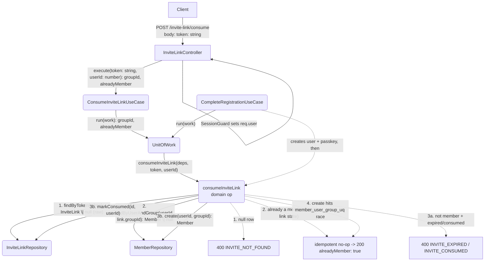
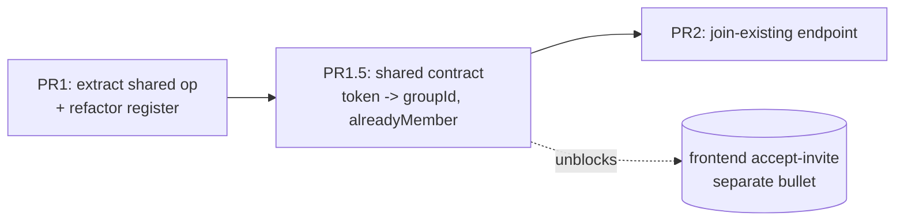

# Goals

Close the group-join loop on the backend so an invite token can actually be
**consumed**. Two entry paths must end in the same outcome — a `Member` row created
and the link marked consumed, atomically:

- **register-new** — a brand-new user registers via an invite token (already wired
  inline in `complete-registration.use-case.ts`).
- **join-existing-user** — an already-authenticated user consumes an invite token to
  join a group. **This path does not exist yet** and is the net-new work.

Single source of truth: extract one transactional consume operation that both paths
call, so the "find usable link → create member → mark consumed" rule lives in exactly
one place.

**Trust model (explicit):** the invite token *is* the capability. The only gate is
authentication (`SessionGuard`); there is no additional "were you invited" authz check
beyond possession of the 256-bit token. Tokens must only be delivered to intended
invitees over a private channel.

# Non-Goals

- No frontend (the `accept-invite` page is a separate roadmap bullet).
- No new invite-link *creation* behavior — `CreateInviteLinkUseCase` is untouched.
- **Multi-use links are currently non-functional and out of scope.** `isConsumable()`
  ignores the `singleUse` column, and `markConsumed` writes a single `consumedByUserId`
  / `consumedAt`, marking the *whole link* spent after the first consume. So a "multi
  use" link behaves as single-use today. This slice does not fix that; it is documented
  here so the `consumedByUserId` model does not mislead a future implementer.
- No member roles/nickname work — `Member` created with defaults.
- No leave-group / un-consume / re-issue flows.
- **Rate limiting is not implemented in this slice.** The consume endpoint is an
  authenticated DB-write path and should be throttled; that is tracked as a hardening
  item (Kitchen Sink) and assumed handled at the edge/gateway for now.
- No change to the WebAuthn registration mechanics; only the link-consume step inside
  `complete-registration` is refactored to call the shared op.

# Desired Behavior

- An authenticated user `POST`s `{ token }` to `/invite-link/consume`.
- On a valid, consumable token for a group the user is **not** yet in:
  - a `Member` row is created for `(userId, groupId)`,
  - the invite link is marked consumed by that user,
  - both happen in one transaction,
  - response is `200 { groupId, alreadyMember: false }` so the caller can route to the
    group.
- On any **existing** token (regardless of the link's usability) for a group the user
  is **already a member of** (reshared link, double-click, or a single-use link they
  already burned): **idempotent no-op** — no second `Member` row, the link is **not**
  (re-)burned, response is `200 { groupId, alreadyMember: true }`. The frontend routes
  the user into the group either way. **Membership is the primary idempotency gate and
  is checked *before* link usability** (see Implementation Details) — this is what makes
  the single-use double-click idempotent rather than a misleading `INVITE_CONSUMED`. It
  holds whether the existing membership is found by the `findByUserAndGroup` guard *or*,
  in a true concurrent race where neither request sees the other's not-yet-committed
  member row, by the `member_user_group_uq` constraint.
- On a token that is not found / expired / already consumed **and for which the caller
  is not already a member**: **single `400`** with a machine-readable discriminator in
  the body so the frontend can render state-specific, accessible recovery copy:
  `{ error: "INVITE_NOT_FOUND" | "INVITE_EXPIRED" | "INVITE_CONSUMED" }`. `INVITE_CONSUMED`
  therefore means "spent, and you are *not* in the group" — a single-use link burned by
  someone else; a caller's own re-consume is caught earlier by the membership gate and
  returns `200`. (Safe to distinguish despite the enumeration-oracle instinct: 256-bit
  `randomBytes(32)` tokens make guessing infeasible, and a caller can only ever query a
  token it already holds — the identifier *is* the secret.)
- Malformed body (missing/empty `token`, or unexpected extra fields): `400` from
  `ZodValidationPipe`, distinguishable from the domain `400` discriminators above.
- Unauthenticated request: rejected by the existing `SessionGuard`.
- register-new path is behaviorally unchanged — same outcome as before, now routed
  through the shared op.

# Design

A transactional routine `consumeInviteLink(deps, input)` holds the rule. Both the new
`ConsumeInviteLinkUseCase` (join path) and the existing `CompleteRegistrationUseCase`
(register path) call it inside their own `uow.run`, so the op never opens its own
transaction — it operates on whatever transactional repos it is handed.

New/changed pieces:

- **`consume-invite-link.ts`** (invite-link domain) — the op:
  `consumeInviteLink(deps: { inviteLinks, members }, input: { token, userId }): Promise<{ groupId, alreadyMember }>`.
  Takes only the two repo interfaces it needs (not the full `TransactionalRepositories`)
  — it needs 2 of the 5 repos, so it should not depend on the whole UoW shape. This
  also keeps fake-repo tests trivial. Note the resulting **`invite-link → member`
  domain dependency**: the op is owned by invite-link because consumption is the invite
  link's responsibility and member creation is its side effect — do not "fix" this by
  moving the op. **Order is membership-first** (see Implementation Details): raw lookup →
  membership idempotency gate → usability classification → create + markConsumed →
  unique-constraint race catch. The op owns the usability rule (expired/consumed), so the
  `INVITE_NOT_FOUND | INVITE_EXPIRED | INVITE_CONSUMED` discriminator falls out of it
  directly.
- **`InviteLinkRepository.findByToken(token): Promise<InviteLink | null>`** — a **raw**
  lookup that does *not* filter on usability (unlike the existing `findUsableByToken`,
  which collapses absent/expired/consumed into `null`). The op needs the raw row to
  (a) read `groupId` for the membership gate even when the link is spent, and (b) classify
  expired-vs-consumed for the discriminator. `isConsumable()`-style logic moves into the
  domain op (`expiresAt < now` → expired; `consumedAt != null` → consumed); the repo just
  returns the row.
- **`MemberRepository.findByUserAndGroup(userId, groupId): Promise<Member | null>`** —
  three edit sites: the interface (`member-repository.ts`), the Drizzle impl
  (`member-repository.drizzle.ts`), and it is automatically available through
  `TransactionalRepositories` (same class instantiated in `unit-of-work.drizzle.ts`).
- **`ConsumeInviteLinkUseCase`** — injects `UNIT_OF_WORK`, wraps the op in `uow.run`,
  returns `{ groupId, alreadyMember }`.
- **`consumeInviteLink` contract** in `libs/shared`: request
  `z.object({ token: z.string().min(1).max(64) }).strict()` (max matches the
  `varchar(64)` token column; `.strict()` rejects unexpected fields so no `userId`/
  `groupId` can be mass-assigned), response `{ groupId: number, alreadyMember: boolean }`,
  and the `400` error envelope discriminator.
- **`InviteLinkController.consume`** — `POST /invite-link/consume`, `SessionGuard`,
  `ZodValidationPipe`, `userId` taken **server-side** from `req.user.id` (never from the
  body). Lives in `invite-link/infrastructure/` alongside the existing controller.
- **`CompleteRegistrationUseCase`** refactored: replace its inline find/create-member/
  markConsumed block with a call to `consumeInviteLink(repos, { token: state.inviteToken, userId: user.id })`.

## Diagram

## Implementation Details

- `consumeInviteLink` order (**membership-first**):
  1. `inviteLinks.findByToken(token)` (raw) → if null throw `InviteLinkNotFound`
     (→ `INVITE_NOT_FOUND`). This is the only place token *existence* is gated.
  2. `members.findByUserAndGroup(userId, link.groupId)` → if found return
     `{ groupId, alreadyMember: true }` **regardless of the link's usability** (no
     create, no markConsumed). This is the primary idempotency gate.
  3. Not a member → classify the link:
     - `expiresAt < now` → throw `InviteLinkExpired` (→ `INVITE_EXPIRED`).
     - `consumedAt != null` → throw `InviteLinkConsumed` (→ `INVITE_CONSUMED`).
     - else (usable) → `members.create` → `inviteLinks.markConsumed(link.id, userId)` →
       return `{ groupId: link.groupId, alreadyMember: false }`.
  4. The `create` in step 3 can still race — see TOCTOU below.
- **Why membership-first.** Checking usability first (the original order) dead-ends the
  *most common* re-consume: a single-use link is burned on first consume, so a
  double-click / reshare finds it consumed and would return `INVITE_CONSUMED` even though
  the caller is already in the group. Reading the raw row and checking membership first
  makes that path an idempotent `200`. `INVITE_CONSUMED` is then reserved for a genuinely
  spent link the caller is *not* a member of.
- **Idempotency / TOCTOU.** The `findByUserAndGroup` check + `create` is a check-then-act
  window. Under a true concurrent double-join both calls can pass the null check and both
  `members.create`; one wins, the other violates `member_user_group_uq` (`schema.ts:113`).
  The op must **catch that unique-constraint violation and treat it as the already-member
  path** — return `{ groupId, alreadyMember: true }` rather than letting a raw
  Drizzle/PG error surface as a `500`. This makes consume genuinely idempotent and means
  no `409` mapping / `MemberExceptionFilter` is required. Note that whether two parallel
  requests serialize (loser hits step 2's membership gate after the winner commits) or
  truly overlap (loser hits this constraint catch), **both resolve to `200`** — so the
  concurrent-consume test is deterministic, not timing-dependent.
- **Error discriminator.** The op throws three distinct domain errors
  (`InviteLinkNotFound` / `InviteLinkExpired` / `InviteLinkConsumed`), each mapped to a
  `400` whose body carries `error: "INVITE_NOT_FOUND" | "INVITE_EXPIRED" | "INVITE_CONSUMED"`.
  Because step 1 fetches the raw row via `findByToken`, the op can cleanly distinguish all
  three (absent row vs `expiresAt` vs `consumedAt`) without a second lookup — the earlier
  "fold consumed into not-found" fallback is no longer needed.
- `markConsumed`'s `where` already re-checks `isConsumable()`, so a concurrent consume of
  the same single-use link by two *different* users updates no row for the loser — the
  compare-and-swap backstop. (Only meaningful for single-use; see Non-Goals on multi-use.)
- For register-new, `findByUserAndGroup` is always null (fresh user), so it adds one DB
  round-trip inside the registration transaction for no functional gain on that path.
  Accepted as the cost of a single source of truth; the register path could skip the
  guard later if it ever matters.
- `userId` is always server-derived from `req.user.id` (`MeUseCase` returns
  `{ id, name, role }`); it is never read from the request body, and `.strict()` on the
  schema rejects any attempt to supply it.

# Testing Strategy

**Approach: e2e, matching the existing suite.** The backend already tests through HTTP
against a real Postgres (testcontainers + supertest) with `setupTestApp` /
`fakePasskeyVerifier` helpers and a truncate-between-tests `afterEach` — see
`test/authentication.e2e-spec.ts`. There are no unit specs and no fake repos; this slice
follows that grain. e2e is also the *higher-fidelity* choice for this slice's actual
risks — the unique-constraint race catch, the real `isConsumable()` SQL classifying
expired-vs-consumed, and transaction rollback all live in the DB layer, which fake-repo
unit tests cannot exercise. (A unit test would only be warranted if the error-classifier
logic grows non-trivial; default to e2e.)

New file: `test/invite-link.e2e-spec.ts`. Authenticate by inserting a `users` + `session`
row and sending the `session_token` cookie (the pattern used by the `me`/`logout` tests).

## register (existing — keep green through the refactor)

The existing `register` test (`authentication.e2e-spec.ts:40-107`) already characterizes
the register-new path end-to-end: it asserts a `member` row is created and the
`invite_link` is consumed. **This is the refactoring safety net** — extract the shared op
and confirm this test stays green; no separate characterization test is needed.

## POST /invite-link/consume (new e2e)

### Joins an authenticated user to the group:
- GIVEN a user + session cookie, a group, and a usable invite link for it.
- POST `/invite-link/consume` `{ token }` with the cookie → `200 { groupId, alreadyMember: false }`.
- Assert a `member` row exists for `(userId, groupId)`; `invite_link.consumed_by_user_id`
  = userId and `consumed_at` not null.

### Idempotent when the user is already a member:
- GIVEN the user is already a `member` of the group, plus a usable link for it.
- POST with the cookie → `200 { groupId, alreadyMember: true }`.
- Assert still exactly **one** `member` row and the link is **not** consumed
  (`consumed_at` null).

### Concurrent double-consume creates exactly one member:
- GIVEN user + session + group + usable link.
- Fire two POSTs in parallel (`Promise.all`).
- Assert both respond `200` and exactly **one** `member` row exists. This is
  **deterministic** under the membership-first order: if the requests serialize the loser
  hits the `findByUserAndGroup` gate (step 2) after the winner commits; if they truly
  overlap the loser hits the `member_user_group_uq` constraint catch (step 4). Either way
  → `200`, never a `500` and never an `INVITE_CONSUMED` `400`.

### Rejects not-found / expired / consumed with a discriminator:
- not-found token → `400` `{ error: "INVITE_NOT_FOUND" }`.
- expired link (`expires_at` in the past) → `400` `{ error: "INVITE_EXPIRED" }`.
- already-consumed link → `400` `{ error: "INVITE_CONSUMED" }` (or folded into
  `INVITE_NOT_FOUND` if classification can't cleanly separate it — assert whichever the
  implementation commits to).

### Rejects unauthenticated and malformed requests:
- No cookie → `401`.
- Empty token / token > 64 chars / body with an extra field (`.strict()`) → `400`
  (validation), distinguishable from the domain `400` discriminators.

# PR Plan

- **PR1 — Extract shared consume op + refactor register (no user-visible change).**
  Add `consumeInviteLink` domain op (idempotent, catches the unique-constraint race),
  `MemberRepository.findByUserAndGroup` (+ Drizzle impl), and refactor
  `CompleteRegistrationUseCase` to call the op. The existing `register` e2e test
  (`authentication.e2e-spec.ts:40-107`) is the regression net — it must stay green. No
  new route, no behavior change for users.
- **PR1.5 — Shared contract.** Land `consumeInviteLink` request/response + `400` error
  envelope in `libs/shared`. No behavioral risk; unblocks the frontend `accept-invite`
  bullet in parallel and shrinks PR2.
- **PR2 — Join-existing endpoint.** Add `ConsumeInviteLinkUseCase`, the `400`
  discriminator mapping (classify not-found/expired/consumed), and
  `InviteLinkController.consume` (`POST /invite-link/consume`). Use-case + contract tests
  green. Ships the endpoint.

# Alternatives Considered

- **New use-case only, leave register inline.** Less churn but duplicates the consume
  rule — rejected; roadmap explicitly wants one use-case covering both.
- **Token in path (`/invite-link/:token/consume`).** More RESTful but inconsistent with
  the codebase's zod-body-validation convention and leaks the token into access logs.
  Rejected in favor of `{ token }` in body.
- **Strict `409 AlreadyMember` on duplicate join (originally chosen, then reversed).**
  Rejected in favor of the idempotent `200 { alreadyMember: true }`. Reasons: the
  reshared-link / double-click re-join is the *most common* "error" a real user hits, and
  a hard `409` dead-ends a user whose intent already succeeded (they wanted to be in the
  group; they are). The idempotent `200` also removes the status-code membership oracle
  (Security 4), carries `groupId` so the frontend can route either way (UX 2), and lets a
  concurrent-race constraint violation resolve to success instead of a `409`/`500`. The
  link is still never double-consumed and no duplicate `Member` row is created.
- **Single opaque `400` ("not found or expired") with no discriminator.** Rejected. The
  enumeration-oracle worry that motivated it does not hold at 256-bit token entropy (a
  caller can only query a token it already possesses), so the machine-readable
  discriminator is adopted to give the eventual `accept-invite` page actionable copy.

# Kitchen Sink

- **Verified:** DB unique constraint `member_user_group_uq` on `(userId, groupId)`
  exists (`schema.ts:113`) — the hard backstop behind the `findByUserAndGroup` guard and
  the basis for idempotent race handling.
- **Verified:** `MeUseCase` returns `{ id, name, role }`, so `req.user.id` is available.
- **Hardening (follow-up):** add rate limiting / throttling to `POST /invite-link/consume`
  — it is an authenticated DB-write path (resource-exhaustion / abuse surface),
  independent of the error discriminator.
- **Standing risk (out of scope):** `groupId` and other ids are sequential
  `generatedAlwaysAsIdentity` integers; every group-scoped endpoint must enforce
  membership authz to avoid IDOR. Tracked app-wide, not in this slice.
- **Future (needs frontend coordination):** consider returning `groupName` alongside
  `groupId` so an accessible client can announce "joined <group>" without a second fetch.
- **Future:** multi-use links + concurrent consume — current `markConsumed` re-check
  handles single-use races; revisit when multi-use is actually implemented (see
  Non-Goals).
