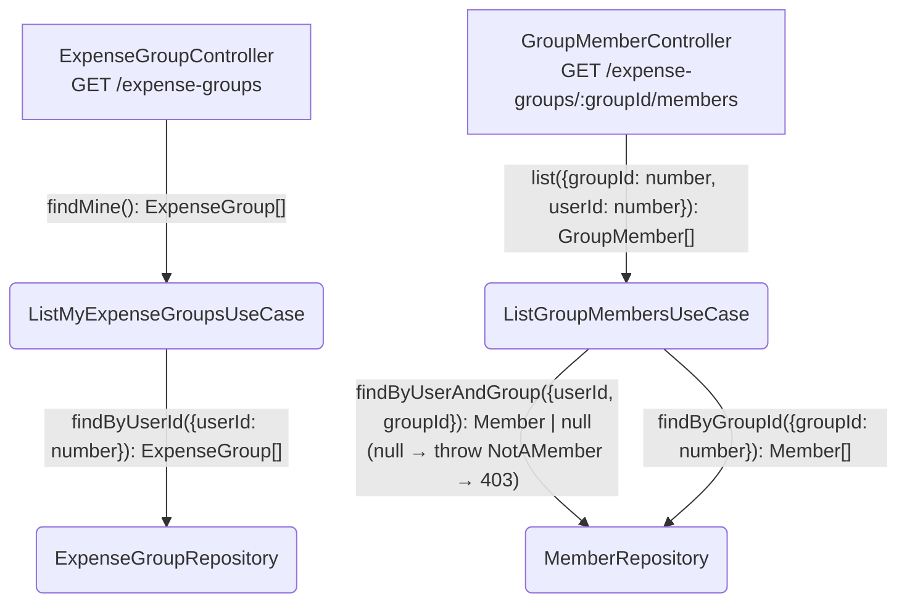
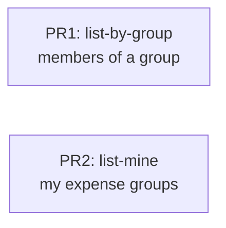

# Goals

Expose the two read endpoints that let the frontend render the home screen and a
group's roster:

- **list-mine** — `GET /expense-groups`: the expense groups the authenticated
  caller belongs to.
- **list-by-group** — `GET /expense-groups/:groupId/members`: the members of a
  group, restricted to callers who belong to that group.

This is Phase 1, bullet 2 of the roadmap. Without these, a user who has joined a
group via an invite link still has no way to see their groups or who else is in
them.

# Non-Goals

- No mutation (rename group, remove member, change moderator) — read only.
- No pagination / filtering / sorting controls — small data, return all rows.
- No change to the existing `GET /expense-groups/:id` (findOne) or
  `GET /members/:id` handlers, including their (lack of) membership authz. Adding
  membership checks there is tracked separately.
- No frontend work — that is a later roadmap bullet.
- list-mine returns group fields only; it does **not** embed the caller's
  membership row (nickname / isModerator).

# Desired Behavior

**list-mine — `GET /expense-groups`**

- Unauthenticated request (no / invalid session cookie) → `401`.
- Authenticated caller → `200` with a JSON array of the groups they are a member
  of: `[{ id, name, currencyCode, createdAt }]`.
- Caller who belongs to no group → `200` with `[]`.
- Groups the caller does not belong to are never returned.

**list-by-group — `GET /expense-groups/:groupId/members`**

- Unauthenticated request → `401`.
- Authenticated caller who is **not** a member of `:groupId` → `403`. This is also
  the response for a non-existent group (do not leak existence).
- Authenticated caller who **is** a member → `200` with a JSON array of every
  member of the group: `[{ id, userId, nickname, isModerator }]` (includes the
  caller themselves).
- `:groupId` that is not an integer → `400` (ParseIntPipe).

# Design

Two vertical slices, each following the existing hexagonal layout
(controller → use-case → repository port → drizzle adapter).

**Response contracts** (in `libs/shared/src/contracts/expense-group.ts`, matching
the existing zod-schema + inferred-type convention). Read-only, so these are
response shapes only — no request schema:

- `expenseGroupSummarySchema` → `{ id, name, currencyCode, createdAt }`;
  list-mine returns `ExpenseGroupSummary[]`. `createdAt` serialized as an
  ISO-8601 UTC string.
- `groupMemberSchema` → `{ id, userId, nickname, isModerator }`; list-by-group
  returns `GroupMember[]`. Note `id` is the **membership-row id**, distinct from
  `userId`; `groupId` is intentionally omitted (redundant — it's in the URL).

Controllers map domain objects to these exact shapes (don't serialize raw
domain/joined rows) so no extra field leaks.

**list-mine** lives in the `expense-group` module:

- `ExpenseGroupRepository` gains `findByUserId(userId): Promise<ExpenseGroup[]>`
  — join `member` on `groupId` filtered by `userId`, ordered by group `id` asc.
- New `ListMyExpenseGroupsUseCase` calls it.
- `ExpenseGroupController` gains `@Get()` → `findMine`, reading `req.user.id`.

**list-by-group** lives in the `member` module. To serve the nested URL without
the expense-group module injecting a member use-case, a dedicated controller is
scoped to the nested prefix:

- `MemberRepository` gains `findByGroupId(groupId): Promise<Member[]>` (ordered by
  member `id` asc). This is **unguarded data access** — it must only ever be
  called downstream of a membership check.
- New `ListGroupMembersUseCase` first verifies the caller is a member
  (`findByUserAndGroup(userId, groupId)`); if `null` it throws a domain error
  `NotAMember` (in `member/domain/member.ts`), mapped to `403` by a `@Catch`
  exception filter — matching the existing `SessionNotFound`/`InviteLinkNotFound`
  pattern, **not** a raw `ForbiddenException` thrown from the application layer.
  The membership check and the `findByGroupId` call stay coupled in this one
  use-case so the unguarded repo method is never reachable on its own.
- New `GroupMemberController` with prefix `expense-groups/:groupId/members`,
  guarded by `SessionGuard`, `@Get()` → `list`, reading `req.user.id` and the
  `:groupId` param.

`req.user` is populated by `SessionGuard` as `{ id, name, role }`. The type is
declared optional (`express.d.ts`), so each new controller narrows it with
`if (!req.user) throw new UnauthorizedException()` — consistent with
`InviteLinkController.consume`.

## Diagram

## Implementation Details

- Both controllers use `@UseGuards(SessionGuard)`; caller id comes from
  `req.user.id`, never from the request body/query.
- `findByUserId` joins `expense_group` to `member` (`member.groupId =
  expense_group.id`) where `member.userId = :userId`, ordered by `expense_group.id`
  asc. The expense-group drizzle adapter has **no** existing `toDomain` helper
  (unlike the member adapter); inline the row→`ExpenseGroup` mapping, or extract a
  small `toDomain` first — implementer's call, just don't assume a helper exists.
- `ListGroupMembersUseCase` throws `NotAMember` for both "not a member" and
  "group does not exist" — the membership lookup returns `null` in both cases, so
  no separate existence check is needed (and existence is never leaked).
- The `403` response body uses the standard exception-filter shape (e.g.
  `{ error: 'NOT_A_MEMBER' }` like the invite-link filter); the message is generic
  and identical for not-member and not-found, so it never reveals whether the
  group exists.
- `GroupMemberController` prefix `expense-groups/:groupId/members` keeps all
  member concerns inside the member module (no cross-module use-case injection).
- Ordering: return groups/members ordered by `id` ascending so tests can assert
  exact array equality deterministically.

# Testing Strategy

e2e (supertest + testcontainers), matching `invite-link.e2e-spec.ts`:
GIVEN/WHEN/THEN, `TRUNCATE ... RESTART IDENTITY CASCADE` between cases.

Assertions use ordered `toEqual` against the documented response shape so both
the field set and the `ORDER BY id` invariant are covered. Member assertions
explicitly check `groupId` is **absent**. list-mine asserts `createdAt` is an
ISO-8601 string.

## list-mine — `GET /expense-groups`

### Returns 401 without a cookie

- WHEN GET `/expense-groups` with no cookie.
- THEN `401`.

### Returns only the caller's groups

- GIVEN user A with a valid session; groups G1, G2, G3; A is a member of G1 and G3
  (not G2).
- WHEN GET `/expense-groups` with A's cookie.
- THEN `200` and body `toEqual` (ordered by id) exactly `[G1, G3]` with keys
  `{ id, name, currencyCode, createdAt }`, `createdAt` an ISO-8601 string, G2
  absent.

### Returns empty array when caller has no groups

- GIVEN user A with a valid session and no membership; one group G1 exists.
- WHEN GET `/expense-groups` with A's cookie.
- THEN `200` and body `[]`.

## list-by-group — `GET /expense-groups/:groupId/members`

### Returns 401 without a cookie

- WHEN GET `/expense-groups/1/members` with no cookie.
- THEN `401`.

### Returns 403 when caller is not a member

- GIVEN user A with a valid session; group G1 with members B and C (not A).
- WHEN GET `/expense-groups/{G1}/members` with A's cookie.
- THEN `403`.

### Returns 403 for a non-existent group

- GIVEN user A with a valid session and no groups.
- WHEN GET `/expense-groups/999999/members` with A's cookie.
- THEN `403`.

### Returns all members when caller belongs to the group

- GIVEN user A with a valid session; group G1 with members A, B, C
  (B nickname "Bob", C isModerator true).
- WHEN GET `/expense-groups/{G1}/members` with A's cookie.
- THEN `200` and body `toEqual` (ordered by member id) A, B, C with their
  `id`, `userId`, `nickname`, `isModerator` — and **no** `groupId` key on any row.

### Returns 401 (not 400) for unauthenticated + malformed groupId

- WHEN GET `/expense-groups/abc/members` with no cookie.
- THEN `401` — `SessionGuard` runs before `ParseIntPipe`, so auth precedes
  validation. (An authenticated caller with `abc` → `400`.)

# PR Plan

The two slices are independent (separate modules, separate repos; PR1 adds the
`groupMemberSchema` contract, PR2 the `expenseGroupSummarySchema` contract — same
file, but non-overlapping exports). Either can merge first. No scaffolding or
pre-tidy PR needed — each slice is small and adds only new code.

- **PR1 — list-by-group**: `groupMemberSchema` contract, `MemberRepository.findByGroupId`
  + drizzle impl, `NotAMember` domain error + exception filter, `ListGroupMembersUseCase`
  (membership check coupled to the listing), `GroupMemberController`, module wiring,
  e2e tests for the five member-list scenarios.
- **PR2 — list-mine**: `expenseGroupSummarySchema` contract,
  `ExpenseGroupRepository.findByUserId` + drizzle impl, `ListMyExpenseGroupsUseCase`,
  `@Get()` on `ExpenseGroupController`, e2e tests for the three list-mine scenarios.

# Alternatives Considered

- **`GET /members?groupId=` (flat route)** — rejected; nested
  `expense-groups/:groupId/members` reads more naturally and was the chosen route.
- **Member listing handled by `ExpenseGroupController`** — would force the
  expense-group module to inject a member use-case (cross-module coupling). A
  dedicated `GroupMemberController` in the member module keeps the boundary clean.
- **list-mine embedding the caller's membership row** — deferred (Non-Goal); the
  home list only needs group names, so the smaller payload ships first.
- **Returning `404` for a non-existent group on member-list** — rejected; `403`
  for both not-a-member and not-found avoids leaking group existence.

# Kitchen Sink

- Existing `GET /expense-groups/:id` and `GET /members/:id` have no membership
  authz — any authenticated user can read any group/member by id. Out of scope
  here; tracked as **issue #1** (gate them behind membership). The membership
  check helper built in PR1 (`findByUserAndGroup`) can be reused there.
- **Bare arrays** (`[...]`), not a `{ data: [...] }` envelope — deliberate (YAGNI).
  Pagination is a Non-Goal; revisit the envelope if/when it lands.
- Future: list-mine ordering by most-recent-activity once payments exist.
