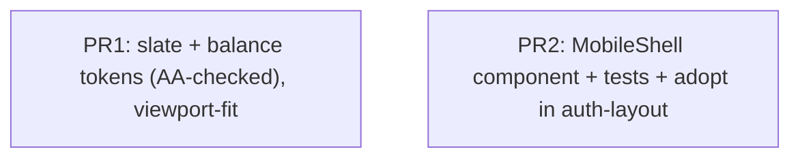

# Goals

A single reusable `MobileShell` component that gives every screen a native-feeling
mobile canvas, so each Phase 1+ frontend slice composes on top of it instead of
re-solving viewport chrome. It provides:

- **Correct height on mobile browsers** — `100dvh`, no scroll-jump as the browser
  address bar shows/hides.
- **Safe-area respect** — content never sits under the notch / home indicator,
  independent of whether a header is present.
- **Centered column** — `max-w-[420px]` on a neutral backdrop so the app degrades
  gracefully on wider viewports without being "designed for desktop". Target canvas
  393×852 (iPhone 15/14 Pro).
- **The chrome-slot pattern** — a content-projection `[appShellHeader]` slot (sticky,
  non-overlapping) plus the default content slot, establishing how feature screens
  compose. The FAB and bottom-tab slots are **deferred** to the slices that
  introduce their consumers (see Non-Goals).

It also establishes the **slate "Ardoise" visual identity**: slate `--primary` /
`--ring`, plus `--balance-positive` / `--balance-negative` tokens for the
owed/owe semantics used from Phase 3 on. Neutral surfaces stay neutral.

This is Phase 1, the first frontend slice — the foundation the group-list,
create-sheet, and accept-invite screens are built on. `auth-layout` adopts it this
slice to prove the API end-to-end with a real consumer.

# Non-Goals

- **No feature screens** — group list, create bottom sheet, and accept-invite are
  separate later slices. Home stays its current stub; only `auth-layout` adopts the
  shell in this slice.
- **No FAB slot, no bottom-tab slot** — neither has a consumer this slice
  (`auth-layout` uses only the default content slot). They are **shell-owned but
  deferred**: the FAB slot lands with the group-list slice (its first consumer); the
  bottom-tab slot lands with the Phase 2–3 in-group-nav slice. The shell-owned
  FAB↔tab geometry coupling is recorded as a constraint in Kitchen Sink so it's
  solved against a real, testable layout rather than an empty slot.
- **No theme toggle** — both light and `.dark` token sets are defined, but there is
  no user-facing switch. The app keeps its current hardcoded `<html class="dark">`.
- **No layout/global state service** — `MobileShell` is purely presentational;
  pages drive it by projecting markup, not by calling a service.
- **No desktop/responsive redesign** — mobile-only; the column is merely centered on
  larger viewports (with a subtle boundary so the framing reads as intentional).
- **No animation library** — any motion uses CSS / Angular animations, gated behind
  `prefers-reduced-motion` (see Implementation Details).
- **No change to auth behavior, guards, or routing** — only `auth-layout`'s wrapping
  markup changes.
- **No app-level security headers** — frame-busting / CSP (`frame-ancestors 'none'`,
  `X-Frame-Options: DENY`) belong to the deploy layer (Docker/Hetzner), tracked
  separately; a presentational shell can't set them.

# Desired Behavior

- The app fills the visible viewport height with no scroll-jump when the mobile
  browser chrome shows/hides (`100dvh`, not `100vh`).
- Content is inset from the notch and home indicator on devices that report safe
  areas (requires `viewport-fit=cover`), **whether or not a header is projected** —
  top content never starts under the notch.
- On viewports wider than 420px the content sits in a centered `max-w-[420px]`
  column over a neutral backdrop, with a subtle border/shadow distinguishing the
  column from the backdrop; at ≤420px it fills the width.
- When a page projects header content, a **sticky `<header>` is rendered as a
  non-overlapping flex sibling** above the main area (it displaces main, it does not
  float over it), respecting the top safe area. When no header content is projected,
  **no `<header>` element is rendered at all** (no empty landmark, no reserved
  space).
- The main content area is the **only scroll container**; the document/body does not
  scroll, and `overscroll-behavior: contain` prevents scroll-chaining / pull-to-
  refresh jump.
- Primary actions render in slate (`--primary`). Balance amounts render green via
  `text-balance-positive` and red via `text-balance-negative`, available app-wide —
  but **color is never the only signal**: balance displays must also carry a sign /
  textual direction / icon (enforced in the balance slices; the contract is set
  here).
- Auth screens (login / register) render inside the shell canvas — same height and
  safe-area guarantees — with their card centered in the main area.

# Design

`MobileShell` is a standalone, presentational Angular component
(`selector: app-mobile-shell`) under `src/app/shared/mobile-shell/`. Pages compose
it and fill named content-projection slots; no inputs, no services.

**Template structure**

- **Canvas** — outer `<div>`: `h-[100dvh] w-full flex justify-center bg-background`
  with safe-area padding applied here via `env(safe-area-inset-*)`, so the inset
  holds regardless of header presence.
- **Column** — inner `<div>`: `relative flex h-full w-full max-w-[420px] flex-col
  overflow-hidden` with a subtle border/shadow so the framed column reads on wider
  viewports.
  - **Header** — a sticky `<header class="sticky top-0 z-10">` wrapping
    `<ng-content select="[appShellHeader]">`, **conditionally rendered** only when
    header content is projected (a `ShellHeader` marker directive detected via
    `contentChild` + `@if`), so no empty landmark or reserved space exists at root.
    It is a flex sibling above main (non-overlapping). The slot marker carries the
    `app` prefix per the project's `@angular-eslint/directive-selector` rule;
    deferred slots will likewise be `[appShellFab]` / `[appShellTabs]`.
  - **Main** — `<main class="flex-1 overflow-y-auto overscroll-contain">`
    wrapping the **default** `<ng-content>`. The only scroll container.

The FAB and bottom-tab slots are intentionally **not** in this template — see
Non-Goals / Kitchen Sink.

**Centering for auth** — the shell main is a top-aligned scroll container by
default; `auth-layout` centers its card itself with a projected wrapper
(`<div class="grid min-h-full place-items-center">`), so the shell needs no
`centered` variant input.

**Projected-content safety** — projected slot content must use Angular
interpolation / standard bindings; any future `[innerHTML]` inside a slot requires
explicit review (content projection is not a sanitizer). The shell itself binds no
user data, so it has no injection surface.

**Token + theme changes** (`src/styles.css`)

- In `:root` and `:root.dark`, retarget the chromatic tokens to slate (hue ~255):
  `--primary`, `--primary-foreground`, `--ring`. Add `--balance-positive` (green,
  hue ~150) and `--balance-negative` (red, reuse the destructive family, hue ~27)
  to both blocks.
- Add a `@theme inline` block (mirroring the hlm preset's pattern) mapping
  `--color-balance-positive: var(--balance-positive)` and
  `--color-balance-negative: var(--balance-negative)` so `text-/bg-balance-*`
  utilities exist.
- **Acceptance criterion**: every retargeted/added token meets WCAG AA contrast
  against the surfaces it pairs with — 4.5:1 for normal text, 3:1 for large text /
  UI components / the focus ring — verified in **both** the light and `.dark` sets.
  The green/red balance tokens are the likeliest to fail on light surfaces; check
  them explicitly.

**`index.html`** — change the viewport meta to
`width=device-width, initial-scale=1, viewport-fit=cover` so `env(safe-area-inset-*)`
resolves to real values on notched devices. Do **not** add `maximum-scale` /
`user-scalable=no` (preserve pinch-zoom).

**Adoption** — `auth-layout.html` wraps its existing `hlmCard` section in
`<app-mobile-shell>` (default slot, centered wrapper). Confirm exactly **one
`<main>`** exists after the refactor (the shell owns it; auth's old `<main>` is
removed). `app.html` stays `<router-outlet />`. Home and future group screens adopt
the shell — and add the FAB / tab slots — in their own slices.

## Diagram

```mermaid
flowchart TD
  AuthLayout["AuthLayout"] -->|projects centered card into default slot| Shell["MobileShell"]
  Home["Home (later slice — adds FAB slot)"] -.->|projects header| Shell
  Shell -->|@if projected: select=shellHeader| HeaderSlot["sticky, non-overlapping header"]
  Shell -->|default ng-content| MainSlot["scrollable main region (only scroll container)"]
  Styles(["styles.css : slate + balance tokens, AA-checked"]) --> Shell
```

## Implementation Details

- **`100dvh`**: use the `dvh` unit directly; no `vh` fallback (modern mobile only).
- **Safe areas**: apply `padding` from `env(safe-area-inset-top/right/bottom/left)`
  on the canvas via Tailwind arbitrary values, e.g.
  `pt-[env(safe-area-inset-top)]`. Inert (0) without `viewport-fit=cover`, hence the
  meta change. The inset lives on the canvas/column, **not** the header, so it holds
  when no header is present.
- **Conditional header**: detect projected header content with `contentChild` (or a
  directive on the slot) and wrap the `<header>` in `@if`, so the landmark and its
  space exist only when there is content.
- **Single scroll container**: only `<main>` scrolls (`overflow-y-auto`); the column
  is `overflow-hidden` so the sticky header stays put and the body never scrolls.
  `overscroll-behavior: contain` on `<main>` blocks scroll-chaining / pull-to-
  refresh, which would otherwise reintroduce the scroll-jump the goals eliminate.
- **Sticky-header focus**: because the header displaces main (non-overlapping flex
  sibling) rather than floating over it, focused/anchored content is not hidden
  behind it; no `scroll-padding-top` hack is required. If a future variant ever
  floats the header, add `scroll-padding-top` equal to header height.
- **Reduced motion**: establish the convention now — all shell/app motion (and the
  future View Transitions work) must be gated behind
  `@media (prefers-reduced-motion: reduce)`.
- **Dark default preserved**: leave `<html class="dark">` as-is; this slice only adds
  the light values for completeness.

# Testing Strategy

Tests use `@testing-library/angular`. jsdom does not compute real layout, so
`100dvh` / `env()` / sticky / scroll-containment is **not** unit-tested — those are
the component's core value and are covered separately (see below). Unit tests cover
projection, conditional rendering, and accessibility hygiene.

## MobileShell component

### Projects header content into a rendered header region:

- Mount a host that projects `<div shellHeader>My Header</div>`.
- Assert "My Header" renders within a `<header>` element.

### Renders no header element when none projected:

- Mount a host with no `shellHeader` content.
- Assert there is **no `<header>` element** in the DOM (not merely zero-height).

### Projects default content into the main region:

- Mount a host projecting plain content into the default slot.
- Assert the content renders within `<main>`.

### Has no accessibility violations:

- Mount with and without a projected header.
- Run `jest-axe` and assert no violations (landmark hygiene, no empty landmark).

## AuthLayout (adoption)

### Renders login inside the shell with a single main landmark:

- Render `AuthLayout` with the `login` child route active.
- Assert `app-mobile-shell` is present, login content renders within it, and there
  is exactly **one** `<main>` element.

## Core layout behavior (manual verification, not jsdom or Playwright)

The load-bearing CSS (dvh height, body-doesn't-scroll-but-main-does, 420px column
cap, sticky header on scroll, safe-area insets) cannot run in jsdom. Standing up a
Playwright/browser-component harness purely to assert three static CSS rules is
deliberately **out of scope** — the cost/benefit doesn't justify it for this
foundational slice, and CSS regressions here are visually obvious in dev and review.
Instead, these guarantees are a **manual checklist**, verified on an **iPhone
simulator that reports non-zero safe-area insets** (a bare 393×852 viewport reports
0 insets and cannot exercise the notch path) — the device is named in the PR
description:

- [ ] The page fills the viewport with no scroll-jump as the address bar shows/hides.
- [ ] `<main>` scrolls while the document/body does not (no double-scroll, no
      pull-to-refresh jump).
- [ ] On a viewport wider than 420px the column caps at 420px and is centered with a
      visible boundary.
- [ ] A projected header stays pinned at the top while `<main>` scrolls.
- [ ] No content sits under the notch or home indicator, with and without a header.

If a browser harness is ever introduced for richer interaction testing, these
become its first specs.

# PR Plan



- **PR1 — visual tokens + viewport meta**: retarget slate tokens, add balance tokens
  + `@theme inline` mapping in `styles.css` (with the AA-contrast check in both
  themes); add `viewport-fit=cover` to `index.html`. Backward-compatible — only
  recolors existing primary and enables safe areas. No new components.
- **PR2 — `MobileShell` + first consumer**: the standalone component (header slot +
  default slot, conditional header, single scroll container), its unit/axe tests,
  the layout CSS verified against the manual checklist, **and** the `auth-layout`
  adoption — so the component lands proven by a real consumer rather than as
  unrendered code. (This merges the previously-separate component and adoption PRs
  per review.)

PR1 and PR2 are independent and each independently shippable; PR1 is kept separate
because it touches global tokens and is backward-compatible on its own.

# Alternatives Considered

- **Shell at app root wrapping `<router-outlet>` with a layout service**: pages would
  call a service to set header/FAB. Rejected — heavier, introduces global mutable
  layout state, and content projection can't reach across a routed outlet. The
  per-page-composes-shell model keeps it presentational and local.
- **Typed inputs (`title`, `rightAction`, `showFab`)** instead of projection slots:
  rejected — too rigid for rich header content (avatars, badges, multi-action),
  per the agreed Shell API decision.
- **Including FAB + tab slots now**: rejected — no consumer this slice, and their
  geometry coupling (below) can't be written or tested against an empty layout.
  Deferred to their consuming slices.
- **Floating (overlapping) sticky header**: rejected in favor of a non-overlapping
  flex sibling — avoids focus-obscuring and the `scroll-padding-top` hack.
- **Pure monochrome / brighter accent palette**: rejected in favor of slate, matching
  the "Ardoise" (slate/chalkboard) theme with neutral surfaces.
- **`100vh` with JS `--vh` hack**: rejected — `dvh` is supported across the target
  mobile browsers and needs no JS.

# Kitchen Sink

- **Deferred shell-owned constraint (Phase 2 tabs slice)**: when the FAB and
  bottom-tab slots are introduced, the FAB bottom-offset MUST be a function of
  tab-slot presence — `bottom: calc(env(safe-area-inset-bottom) + var(--tabbar-h,
  0px) + 16px)`, collapsing to `calc(env(safe-area-inset-bottom) + 16px)` when no
  tabs — and this coupling MUST be covered by a test that renders a FAB and an
  occupied tabs slot together. FAB and tab items must be ≥44×44px touch targets,
  `<main>` must reserve bottom padding so content isn't permanently hidden under
  them, and the FAB must not be clipped by the column's `overflow-hidden` (move it
  outside the clip or keep its elevation within bounds).
- **Loading / error overlays**: convention — feature slices mount their own
  full-canvas loading/error state **inside `<main>`** (below any header, within safe
  areas) so placement stays consistent; revisit a dedicated `[shellOverlay]` slot
  only if drift appears.
- **Open**: exact slate oklch lightness/chroma values are tunable during PR1 — start
  near `--primary: oklch(0.42 0.045 255)` (light) and verify contrast on the dark
  default.
- **Future**: View Transitions API for route changes (Angular 21 supports it) — a
  cheap smoothness win, deferred; must honor `prefers-reduced-motion`.
- **Future**: a "skip to main content" link — low value for a tiny app today, noted
  for when navigation grows.
