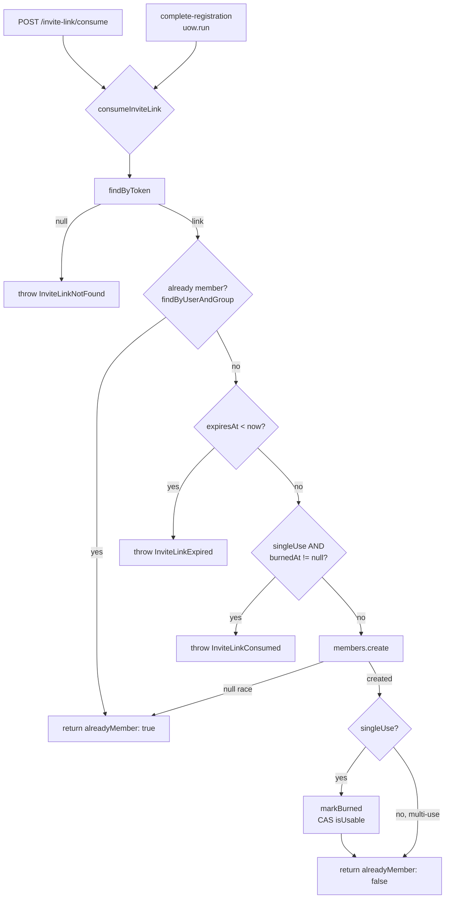
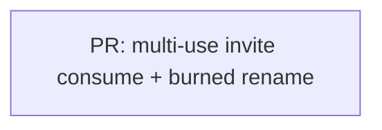

# Goals

Make the `singleUse` flag on invite links actually functional, closing the gap documented as a
non-goal in `001-invite-link-consume-backend.md`, and rename the spent-marker columns to remove a
naming collision the fix exposes.

- A **multi-use** link (`singleUse = false`) admits many distinct users — each becomes a
  `Member` — until `expiresAt` passes.
- A **single-use** link (`singleUse = true`) still burns after the first successful consume:
  a second distinct user is rejected with `INVITE_CONSUMED` (unchanged behavior).
- **Rename** `consumedAt → burnedAt` and `consumedByUserId → burnedByUserId` (schema, entity,
  repository). After this fix these columns are stamped *only* for single-use links, so
  "consumed" becomes a misnomer and collides with the consume **action** (`consumeInviteLink` /
  `POST /invite-link/consume`, which applies to all links). New vocabulary: **consume** = "join
  via a link" (any link); **burn** = "invalidate a single-use link."

This unblocks the frontend "create group → share invite link" flow (roadmap Phase 1), where one
link is handed to several people. Today every link — regardless of the flag — is burned after the
first join, so a shared link only lets the first person in.

# Non-Goals

- **No new `invite_link` columns and no new table.** This is a *rename* of existing columns, not
  a structural change. An `invite_link_consumption` table would largely duplicate `member` for
  the join use-case.
- **No usage counter / `maxUses`.** Only `{once, unlimited-until-expiry}` is needed for v1; a
  counter is YAGNI and adds increment-race complexity the current compare-and-swap avoids.
- **No contract change.** The three discriminators (`INVITE_NOT_FOUND` / `INVITE_EXPIRED` /
  `INVITE_CONSUMED`) and the `{ groupId, alreadyMember }` response are unchanged. The consume
  action/endpoint keep their names — only the persisted spent-marker is renamed.
- **Not fixing the pre-existing single-use concurrent-distinct-user race** (see Kitchen Sink).
- **Not changing the register-path quirk** where an expired link surfaces as `INVITE_NOT_FOUND`
  (via `findUsableByToken`) rather than `INVITE_EXPIRED` (see Kitchen Sink).

# Desired Behavior

- Consuming a **multi-use** link as a non-member creates a `Member` and returns
  `{ groupId, alreadyMember: false }`. The link is **not** burned — `burnedAt` /
  `burnedByUserId` stay `NULL`.
- A second, different user consuming the **same multi-use** link also joins successfully
  (`alreadyMember: false`), as long as `now < expiresAt`.
- Consuming an **expired** link (either type) as a non-member returns `400 INVITE_EXPIRED`.
- Consuming a **single-use** link burns it: `burnedAt` / `burnedByUserId` are stamped, and a
  second distinct user gets `400 INVITE_CONSUMED` (unchanged).
- Consuming **any** link when already a member returns `{ alreadyMember: true }` and never
  mutates the link (unchanged idempotency).
- Both consumption paths honor this, because both converge on the same domain function
  `consumeInviteLink`:
  - existing-user join → `POST /invite-link/consume`
  - new-user registration → `complete-registration.use-case.ts` (inside the unit-of-work)

# Design

Two parts: a behavior fix (the core) and a mechanical rename.

**1. Behavior — `consume-invite-link.ts`.** Two guards become conditional on `link.singleUse`:

```ts
const now = new Date();
if (link.expiresAt < now) throw new InviteLinkExpired();
if (link.singleUse && link.burnedAt !== null) throw new InviteLinkConsumed();  // (1)

const created = await deps.members.create({ userId: input.userId, groupId: link.groupId });
if (created === null) return { groupId: link.groupId, alreadyMember: true };

if (link.singleUse) {
  await deps.inviteLinks.markBurned(link.id, input.userId);                     // (2)
}
return { groupId: link.groupId, alreadyMember: false };
```

**Why the surrounding code still behaves correctly:**

- **`isUsable()` (renamed from `isConsumable()`) needs no logic change.** It filters on
  `isNull(burnedAt) AND isNull(burnedByUserId) AND expiresAt > now`. Multi-use links never stamp
  those columns, so they naturally pass — `findUsableByToken` (used by `begin-registration`)
  already returns multi-use links correctly.
- **`markBurned`'s compare-and-swap stays correct.** It is now only invoked for single-use
  links, where the `isNull(burnedAt)` guard gives the single-winner stamp.
- **Registration path is untouched.** `complete-registration` calls the same `consumeInviteLink`;
  fixing the function fixes both entry points.

**2. Rename — schema + entity + repository.** Pure mechanical rename, no behavior:

| Location | Before → After |
|---|---|
| `schema.ts` (`invite_link`) | `consumedAt → burnedAt`, `consumedByUserId → burnedByUserId` (snake_case columns `burned_at`, `burned_by_user_id`) |
| `invite-link.ts` (domain entity) | `consumedAt → burnedAt`, `consumedByUserId → burnedByUserId` |
| `invite-link-repository.drizzle.ts` | `markConsumed → markBurned`, `isConsumable → isUsable`, `toDomain` field mapping |
| `invite-link-repository.ts` (port) | `markConsumed → markBurned` |
| `test/helpers/seed.ts` | `consumedByUserId` opt → `burnedByUserId`; column names in INSERT |

The consume action stays named `consumeInviteLink` / `markBurned` is what it calls — that's the
collision being resolved.

## Diagram



## Implementation Details

- **Migration.** Edit `schema.ts`, then `pnpm db:generate` produces `0005_*.sql` under
  `src/shared/database/migrations`. drizzle-kit may emit `DROP COLUMN` + `ADD COLUMN` instead of a
  rename — verify/adjust it to `ALTER TABLE invite_link RENAME COLUMN consumed_at TO burned_at`
  (and likewise for `consumed_by_user_id`). No deployed data exists yet, so even a drop+add is
  safe, but the rename is the honest migration. Apply with `pnpm db:migrate`.
- **Ordering preserved.** The already-member check stays *before* the usability checks, so a user
  who already joined via a now-expired/burned link still gets `alreadyMember: true` rather than an
  error. Existing, intentional idempotency.
- **Multi-use double-join protection** for the *same* user relies on the `findByUserAndGroup`
  membership check, with `members.create` returning `null` on unique-violation as a concurrency
  backstop (both already in place).
- **Column semantics, post-change:** for single-use links `burnedAt`/`burnedByUserId` are the
  burn-lock + audit; for multi-use they are permanently `NULL`. The `member` table is the record
  of who joined a multi-use link.

# Testing Strategy

e2e via testcontainers in `apps/backend/test/invite-link.e2e-spec.ts` (project convention — real
Postgres, no unit specs). Existing single-use tests must stay green (updated for the renamed
columns); add the multi-use coverage.

## consume — multi-use admits multiple distinct users

- Arrange: seed a group and a `singleUse: false` link (`seedInviteLink({ groupId, token,
  singleUse: false })`). Seed user A + session, user B + session.
- Act: user A `POST /invite-link/consume`, then user B `POST /invite-link/consume` with the same
  token.
- Assert: both respond `200 { groupId, alreadyMember: false }`; `member` has 2 rows for the group;
  the `invite_link` row's `burned_at` and `burned_by_user_id` are still `NULL`.

## consume — expired multi-use link rejects with INVITE_EXPIRED

- Arrange: seed a `singleUse: false`, `expiresInDays: -1` link; a non-member user + session.
- Act: `POST /invite-link/consume`.
- Assert: `400 { error: 'INVITE_EXPIRED' }`.

## consume — single-use still burns after first consume (regression guard)

- Arrange: seed a `singleUse: true` link (default); user A + session, user B + session.
- Act: user A consumes (joins, burns), then user B consumes the same token.
- Assert: A → `200 { alreadyMember: false }` and the row's `burned_at`/`burned_by_user_id` are
  stamped to A; B → `400 { error: 'INVITE_CONSUMED' }`; exactly one `member` row.

## (existing, must stay green — column refs updated to burned_*)

- "creates an invite link" (asserts `consumed_at: null` → `burned_at: null`), "joins an
  authenticated user" (single-use burn → asserts `burned_*`), "is idempotent when already a
  member", "concurrent double-consume creates exactly one member", "rejects not-found / expired /
  consumed", "rejects unauthenticated and malformed requests".

# PR Plan



One focused slice. The behavior fix and the rename are coupled — the rename is *motivated by* the
new single-use-only semantics — so shipping them together keeps the columns honest the moment the
behavior lands. Built via the red/green cycle, naturally sequenced in two commits if useful:

- **commit 1 — rename** `consumed* → burned*` across schema/entity/repository/seed + migration
  (mechanical, no behavior change; existing tests stay green after column-ref updates).
- **commit 2 — behavior** gate the consumed-rejection and `markBurned` call on `link.singleUse`;
  add the three e2e scenarios above.

No contract change; no registration-flow change.

# Alternatives Considered

- **Keep `consumedAt` naming** and document the columns as single-use-only — rejected: the
  consume-action vs consumed-column overlap is a live ambiguity this change introduces, worth the
  small rename now rather than letting it ossify.
- **Separate `invite_link_consumption` table** (normalized per-consumer tracking) — rejected:
  duplicates the `member` table for the join use-case without new value.
- **`maxUses: int` counter** generalizing single/multi/N-use — rejected: YAGNI for v1 and
  introduces increment races the current burn compare-and-swap sidesteps.
- **Reorder `markBurned` before `members.create`** to make single-use truly single-winner across
  distinct users — deferred: pre-existing race, out of scope for this slice.

# Kitchen Sink

- **Pre-existing single-use race (distinct users):** because `members.create` runs before
  `markBurned`, two *different* users consuming one single-use link concurrently can both join
  (member uniqueness is per `(user, group)`, and the CAS only guards the stamp, not the prior
  member insert). Not introduced by this change; the existing "concurrent double-consume" test
  exercises the *same* user only. Candidate for a future hardening slice.
- **Register-path expiry quirk:** `begin-registration` uses `findUsableByToken`, so a new user
  registering with an expired link gets `INVITE_NOT_FOUND` rather than `INVITE_EXPIRED`.
  Pre-existing, minor, out of scope.
- **Future ideas:** link revocation, per-link usage analytics, `maxUses` if a real need appears.
