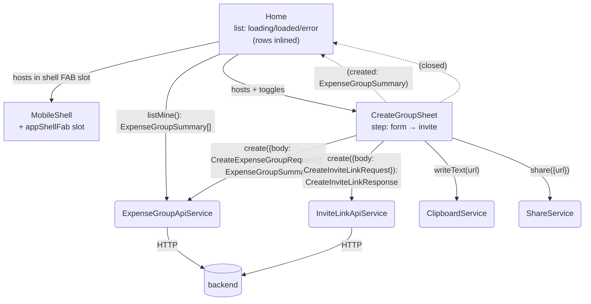
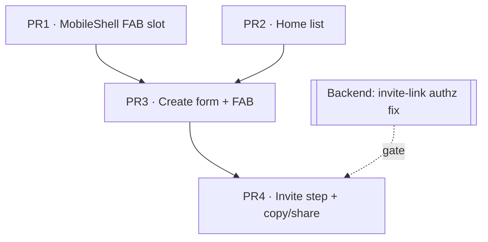

# Goals

The authenticated **home screen** is the entry point of the app. This slice makes it
real:

- List the signed-in user's expense groups (via `expenseGroupApi.listMine`), each row
  showing the group **name** and a **reserved balance-badge slot** (left empty for now).
- Show a friendly **empty state** with a clear call-to-action when the user belongs to no
  groups.
- A **FAB** (`+`) opens a near-full-height **create-group bottom sheet**.
- On successful creation the sheet **flips to an invite-link view** that lets the user
  **copy** or **share** a join URL, so a brand-new group is immediately shareable.
- Adopt `MobileShell` for the home screen (sticky header + scrollable list), matching the
  layout shipped in `003-mobile-shell-frontend.md`.

# Non-Goals

- **Member count on rows.** `expenseGroupSummary` does not carry one and we will not add a
  backend field or do an N+1 `member.listByGroup` per row in this slice. The row reserves
  visual space only for the future balance badge.
- **Tapping a group / group-detail screen.** Rows are display-only; there is no detail
  route yet (future slice). Rows are styled to *not* look tappable (see Desired Behavior).
- **The accept-invite landing page.** That is the next roadmap bullet. Here we only
  *generate and share* the invite URL; the page that consumes it is out of scope. As a
  consequence, an **existing** user who opens the link cannot join yet — only the new-user
  `/register` path is wired (see Desired Behavior → invite step microcopy, and Kitchen Sink).
- **Invite-link management** (listing, revoking, choosing expiry/single-use in the UI). The
  create flow uses fixed defaults: **multi-use, 24-hour expiry**. The link is *regenerable*
  by re-running the create flow, which is the only recovery path this slice offers.
- **Editing / deleting / leaving a group.**
- **Pull-to-refresh / pagination / search.** The list is a single fetch.
- **Logout.** The stub home currently has a logout button; this slice replaces that page
  and the header is title-only, so logout has **no home entry point** until a later
  account/menu slice. PR2 therefore *removes a currently-working capability* — this is
  intentional and called out in the PR plan, not a silent regression.

# Desired Behavior

**Home list**

- On load, the home screen shows a centered **spinner** while groups are fetched
  (`HlmSpinner` already provides `role="status"`).
- When the user has groups, they render as a vertical list of rows; each row shows the
  group **name** and an empty balance-badge slot. Rows are **not interactive** and are
  styled flat (no chevron, no card elevation, no hover/active/ripple affordance) so they do
  not read as tappable.
- When the user has no groups, an **empty state** is shown:
  - title "No groups yet", body "Create a group to start splitting expenses with friends."
  - In PR2 the empty state is **text-only**. The primary CTA button ("Create your first
    group", same action as the FAB) arrives with the FAB in PR3.
- If the fetch fails, an **error state** is shown inline: "Couldn't load your groups." /
  "Check your connection and try again." / **Retry** button.
- A floating **`+` FAB** is pinned bottom-right above the safe-area inset; tapping it opens
  the create sheet. The FAB has an accessible name (`aria-label="Create a group"`); the `+`
  glyph is `aria-hidden`. (FAB + empty-state CTA both arrive in PR3.)

**Create-group sheet (form step)**

- The sheet slides up to near-full height. It renders an `hlmSheetTitle` ("Create a group")
  so the dialog has an accessible name.
- It contains a labelled **group name** input (required, `aria-required`) and a labelled
  **currency** selector — a dropdown of common codes (EUR, USD, GBP, CHF…) defaulting to
  `EUR` — plus a primary **Create** button pinned in a sticky footer (thumb zone) and a way
  to dismiss (close button / backdrop).
- **Create** is disabled while the name is empty or a request is in flight; the button shows
  a loading state during submission (native `disabled`, matching `Register`; repeat submits
  guarded).
- On success the sheet **flips to the invite step** (it does not close); the height change
  is animated. The step's new `hlmSheetTitle` provides the context change.
- On failure it shows an inline error: "Couldn't create the group. Your details are saved —
  try again." / **Retry**; the form values are preserved.

**Create-group sheet (invite step)**

- Renders an `hlmSheetTitle` ("Group created") and a short confirmation.
- Expectation-setting helper text (because existing users can't join yet): "Share this link
  to invite people. They'll create an account to join." — keep this honest until the
  accept-invite page lands.
- The generated **join URL** is shown in a labelled `<input readonly>` (label "Invite link";
  `readonly`, **not** `disabled`, so it stays selectable and in the a11y tree).
- A **Copy** button copies the URL to the clipboard; feedback is the label swapping to
  "Copied ✓" for ~2s, surfaced in a polite `role="status"` live region.
- A **Share** button invokes the native share sheet when available. When it falls back to
  copy (no `navigator.share`), the feedback reads "Link copied — paste it to share" (not
  "Copied"), so the outcome matches the action taken.
- On invite-link **failure** the step shows its own error (the group already exists): "Group
  created, but we couldn't generate an invite link. Try again." / **Retry link** — retry
  re-runs only the invite call.
- A **Done** button closes the sheet; backdrop/Escape/back dismissal on the invite step is
  equivalent to Done (safe close — the group already exists).
- After a successful create, the home list **silently refetches** (`listMine` again, keeping
  the current list visible — no spinner) so the new group appears in the server's canonical
  order.

# Design

**Components**

- **`Home`** (page, replaces the stub) — wraps content in `MobileShell` (title-only sticky
  header). Owns the **list state machine** signal `loading | loaded(groups) | error`,
  fetched once via `ExpenseGroupApiService.listMine`. Renders the spinner / list / empty /
  error views (rows are inlined — see below), hosts the FAB (in the new shell FAB slot) and
  the `CreateGroupSheet`, and **silently refetches** its list when `created` fires.
  Group rows are **inlined** in `Home`'s template (a name + an empty balance slot — too thin
  to justify a separate component/spec yet; extract a `GroupListItem` in Phase 3 when the
  balance badge needs real formatting/behavior).
- **`CreateGroupSheet`** (sheet content) — owns the **two-step state machine** (see shapes
  below). Drives the create→invite chain and the copy/share actions. `output created:
  ExpenseGroupSummary` (emitted as soon as the group exists) and `output closed` (Done /
  dismiss). The spartan `BrnSheet` owns open/close, focus trap, restore-focus, and Escape.

**Services**

- **`ExpenseGroupApiService`** (existing) — uses `listMine` and `create` (already present).
- **`InviteLinkApiService`** (new) — thin `createApiClient(inviteLinkApi, …)` wrapper
  exposing `create`, mirroring `ExpenseGroupApiService`.
- **`ClipboardService`** + **`ShareService`** (new, tiny) — wrap `navigator.clipboard.write
  Text` and the feature-detected `navigator.share`. Injecting them (rather than touching
  `navigator` directly in the component) keeps specs from stubbing globals and matches the
  provider-mocking convention used in `register.spec.ts`.

**Shared / UI**

- **`MobileShell`** gains an optional **FAB slot** (`[appShellFab]` directive, a direct copy
  of the existing `[appShellHeader]` `contentChild` pattern), positioned `absolute`
  bottom-right inside the relative 420px column (above the bottom safe-area inset) so it
  stays pinned while `<main>` scrolls — realizing the FAB slot reserved in
  `003-mobile-shell-frontend.md`.
- Vendored helm component **`libs/ui/sheet`** (already added via spartan CLI and wired into
  tsconfig `paths` as `@spartan-ng/helm/sheet`; `HlmSheetImports` exposes trigger / content /
  header / title / description / footer / close), built on `@spartan-ng/brain/sheet` (CDK
  Dialog — gives `role="dialog"`, `aria-modal`, focus trap, restore-focus, Escape for free).

**Create → invite chain**

1. `ExpenseGroupApiService.create({ body: { name, currencyCode } })` → `ExpenseGroupSummary`.
2. Emit `created` (group now exists; `Home` silently refetches its list regardless of what follows).
3. `InviteLinkApiService.create({ body: { groupId, singleUse: false, expiresAt } })`
   → `{ token }`, where **`groupId` is taken from the step-1 response** (`summary.id`), never
   from form input, and `expiresAt = now + 24h` (ISO string).
4. Build the join URL and transition to the `invite` step.

If step 3 fails the group still exists (already created and shown via the refetch); the invite step shows an error
with **Retry link** that re-runs only step 3 (never re-creates the group).

## Diagram

## Implementation Details

- **List state** type: `{ status: 'loading' } | { status: 'loaded'; groups: ExpenseGroupSummary[] } | { status: 'error' }`. Empty list = `loaded` with `groups: []`, driving the empty-state branch in the template.
- **Sheet state** type: `{ step: 'form'; status: 'idle' | 'submitting' | 'error' } | { step: 'invite'; status: 'idle' | 'submitting' | 'error'; url: string | null }`. The invite step carries its **own** `status` so the invite-create failure/retry is representable (`url` is set once the token arrives).
- **"Copied" is transient UI, not flow state** — a separate `signal<boolean>` reset by a timer, kept out of the discriminated union to avoid a dangling timer in the machine.
- **Silent refetch on `created`:** `Home.load({ silent: true })` re-calls `listMine` without resetting to `loading`, so the current list stays on screen and the new group lands in the server's canonical order (the list query sorts `asc(id)`, so a prepend would have mis-placed it). Reopening the sheet for another group resets `CreateGroupSheet` to `form/idle`.
- **`groupId` from the create response:** the invite call uses `summary.id` returned by step 1 — the client is never the authority on which group gets a link (pairs with the backend authz fix below).
- **Invite expiry:** `expiresAt = new Date(Date.now() + 24 * 60 * 60 * 1000).toISOString()` — multi-use, 24h, regenerable. The contract body input is the ISO string (Zod transforms it server-side).
- **Join URL:** `` `${location.origin}/register?token=${token}` `` for now — `register` already reads `?token=`. **Hardening (see Security Considerations):** move the token into the URL fragment (`#token=`) + `history.replaceState` to strip it, and/or POST it, once the accept-invite consumer is built. Specs assert the URL only via `endsWith('/register?token=<token>')`, never the full string, so the Phase change doesn't churn them.
- **Copy / Share via injected services** (feature-detect `navigator.share` inside `ShareService`); both branches are exercised in specs by mocking the service, no global stubbing.
- **In-flight guards:** Create disabled when name is blank; repeat submits ignored while `submitting` (mirrors `Register`'s guard).

## Accessibility

Spartan + CDK already handle the hard parts — **do not re-add them**: the sheet (brain
dialog) provides `role="dialog"`, `aria-modal`, focus trap, restore-focus and
Escape-to-close; `HlmSheetContent` ships a close button with an `sr-only` "Close";
`HlmSpinner` already exposes `role="status"`. The first rule of ARIA applies — only the few
app-owned, native-first essentials below remain:

- **Dialog name (required, not optional).** Render an `hlmSheetTitle` in each step ("Create a
  group" → "Group created"). The brain dialog sets `aria-labelledby="brn-dialog-title-…"`
  *unconditionally*; with no title rendered it dangles at a missing node and the dialog
  announces unnamed.
- **FAB name.** It's an icon-only button — `aria-label="Create a group"`, `+` glyph
  `aria-hidden`.
- **Form labels.** A `<label>` on the name input (`required`) and the currency control. A
  native `<select>` is the simplest accessible choice; if the spartan select (a combobox) is
  used instead, label it.
- **URL field.** `<input readonly>` — not `disabled`, which would drop it from the tab order
  and the a11y tree.

Design checks (CSS / visual, not ARIA): FAB + sheet controls ≥44×44 px touch target; FAB icon
≥3:1 contrast over scrolling rows; the transient "Copied" confirmation should be perceivable
to AT — a small `aria-live="polite"` text node is enough, kept light.

## Security Considerations

- **Backend IDOR (blocker, tracked separately).** The shipped `create-invite-link` endpoint
  does **not** verify the caller is a member/moderator of `groupId` (no `@CurrentUser` check;
  `groupId` is sequential), so anyone can mint an invite for any group. This frontend slice
  is the endpoint's first consumer. **A membership check must land before PR4 ships / before
  production.** Tracked in [#15](https://github.com/rznn7/ardoise/issues/15).
- **Token in URL.** A query-string token leaks via history, `Referer`, and access logs. Move
  it to the fragment (`#token=` + `history.replaceState`) or POST it, and set
  `Referrer-Policy: no-referrer` on the accept page. Done with/at the accept-invite slice;
  noted here so it isn't lost.
- **Contracts `.strict()`.** Add `.strict()` to `createExpenseGroupRequestSchema` and
  `createInviteLinkRequestSchema` so unknown keys (e.g. a client-supplied `token`,
  `isModerator`) are rejected — mass-assignment defense in depth. Bound the group `name`
  (`.min(1).max(N)`).
- **XSS.** Render group name and join URL via Angular interpolation / `[value]` only — never
  `[innerHTML]`, never `[href]` without sanitization.
- **Open redirect** is not a risk here (`location.origin`), but the future accept page must
  allowlist any `redirect`/`next` param against relative same-origin paths.

# Testing Strategy

Component specs with `@testing-library/angular` + Vitest, services mocked via `providers`
and `vi.fn` returning observables (`of` / `throwError` / `Subject`), following
`register.spec.ts`. `ClipboardService` / `ShareService` are provider-mocked too (no global
`navigator` stubbing).

## Home

### Shows a spinner while groups load:

- Arrange `ExpenseGroupApiService.listMine` to return a never-emitting `Subject`.
- Render `Home`.
- Assert a spinner (`role="status"`) is shown and no rows.

### Renders a row per group:

- Arrange `listMine` → `of([{ name: 'Trip' }, { name: 'Flat' }])` summaries.
- Render `Home`.
- Assert "Trip" and "Flat" are displayed, each with a (present-but-empty) balance slot.

### Shows the empty state when there are no groups:

- Arrange `listMine` → `of([])`.
- Render `Home`.
- Assert the empty-state title/body are shown. (CTA button asserted from PR3 on.)

### Shows an error with retry when the fetch fails, and retries:

- Arrange `listMine` → `throwError` once, then `of([{ name: 'Trip' }])`.
- Render `Home`, click **Retry**.
- Assert the `role="alert"` error then "Trip" is shown; `listMine` called twice.

### FAB and empty CTA open the create sheet: _(PR3)_

- Arrange `listMine` → `of([])`.
- Render `Home`, click the `+` FAB (and, separately, the empty CTA).
- Assert the create sheet (dialog titled "Create a group", group-name field) is visible.

### Refreshes the list without a spinner when a group is created: _(PR3)_

- Arrange `listMine` → first `of([Flat])`, then a pending `Subject` for the refetch.
- Render `Home`; open the sheet, enter a name, click Create.
- Assert `listMine` called twice, the existing list stays visible, and no spinner shows during
  the refetch; then emit `[Flat, Trip]` and assert "Trip" appears.

## CreateGroupSheet

### Create is disabled until a name is entered:

- Render `CreateGroupSheet`.
- Assert the Create button is disabled; type a name; assert it becomes enabled.

### Creates the group with the entered name and selected currency:

- Render; type "Trip", select USD, click **Create**.
- Assert `ExpenseGroupApiService.create` called with `{ body: { name: 'Trip', currencyCode: 'USD' } }`.

### Emits `created` with the returned summary:

- Arrange `create` → `of({ id: 7, name: 'Trip', … })`.
- Render with a spy on `created`; submit.
- Assert `created` emitted the summary.

### Chains the invite link (from the response id) and shows the join URL: _(PR4)_

- Arrange group `create` → `of({ id: 7, … })`, `InviteLinkApiService.create` → `of({ token: 'abc' })`.
- Render; submit.
- Assert `inviteLink.create` called with `{ body: { groupId: 7, singleUse: false, expiresAt: <iso> } }`
  (`groupId` from the response) and the invite step shows a URL ending in `/register?token=abc`.

### Copy writes the URL to the clipboard: _(PR4)_

- Arrange the invite step; mock `ClipboardService.writeText`.
- Click **Copy**.
- Assert `writeText` called with the join URL and the polite "Copied" status appears.

### Share uses the native share sheet when available, else falls back to copy: _(PR4)_

- With `ShareService` reporting share available: click **Share** → assert `ShareService.share` called with `{ url }`.
- With share unavailable: click **Share** → assert `ClipboardService.writeText` called and the status reads "Link copied — paste it to share".

### Shows an error with retry on group-create failure, preserving the form:

- Arrange `create` → `throwError` once, then `of({ id: 7, … })`.
- Render; type "Trip"; submit; assert the `role="alert"` error shown and "Trip" still in the field; click
  **Retry**; assert it advances (invite step / created emitted).

### Invite-step retry re-runs only the invite call: _(PR4)_

- Arrange group `create` → `of({ id: 7, … })`, `inviteLink.create` → `throwError` once then `of({ token: 'abc' })`.
- Render; submit; on the invite error click **Retry link**.
- Assert `create` (group) called once, `inviteLink.create` called twice, `created` emitted once.

### Ignores repeated submissions while in flight:

- Arrange `create` → `Subject` (pending). Submit twice.
- Assert `create` called once.

### Done emits `closed`: _(PR4)_

- Reach the invite step; spy on `closed`; click **Done**.
- Assert `closed` emitted.

## MobileShell

### Projects FAB content into the FAB slot:

- Render `MobileShell` with an element marked `appShellFab`.
- Assert the projected FAB element is in the DOM.

# PR Plan

- **PR1 — MobileShell FAB slot (scaffold).** Add the `[appShellFab]` slot to `MobileShell`
  (+ projection spec). Purely additive; `libs/ui/sheet` is already vendored. (Per XP review,
  the new services move to PR4 where they're first used, so PR1 is just this shared-component
  change.)
- **PR2 — Home list.** Replace the stub `Home` with a `MobileShell`-based list: state machine
  (loading / loaded / empty / error + retry) wired to `listMine`, with **inlined** rows.
  Empty state is **text-only**; **no FAB/CTA chrome yet** (they arrive whole in PR3, avoiding
  a half-wired inert button). **Note:** this removes the stub's working logout — intentional,
  per Non-Goals. Independent of PR1.
- **PR3 — Create-group form + FAB.** Add `CreateGroupSheet` (form step only: name + currency
  → `create` → emit `created`), wire the FAB **and the FAB slot's** use + the empty-state CTA
  to open it, and have `Home` **silently refetch** on `created`. A working create flow (no
  invite view yet). Includes the form-step a11y essentials (dialog title, FAB name, form
  labels). Depends on PR1 (slot) + PR2 (Home).
- **PR4 — Invite step (copy/share).** Add `InviteLinkApiService`, `ClipboardService`,
  `ShareService`; extend `CreateGroupSheet` with the invite step: chain `inviteLink.create`
  (id from response, multi-use/24h), show the join URL with Copy / Share / Done, the
  invite-only retry, and the expectation-setting microcopy. Add `.strict()` + name bound to
  the contracts. **Gated on the backend invite-link authz (IDOR) fix.** Depends on PR3.

# Alternatives Considered

- **Member count on rows** (backend field or per-row `member.listByGroup`) — rejected for
  this slice: a backend change widens a "frontend" slice, and N+1 requests are wasteful.
- **Extracting a `GroupListItem` component now** — rejected (XP review): a non-interactive
  name + empty slot is too thin to justify a component and its own spec; inline it and extract
  in Phase 3 when the balance badge needs real behavior.
- **Single-use / shorter-than-24h invite default** — considered (security review) and
  rejected after a challenge round: with no invite-management UI and non-interactive rows,
  single-use is a usability trap (link dies after the first friend joins, no resurfacing
  path). Resolution: **multi-use + 24h, regenerable** — security withdrew the single-use
  requirement (the real risk was the IDOR + token-in-URL, now tracked), and 24h (vs 7d) cuts
  the leak window ~85% at near-zero UX cost since invites are acted on within hours.
- **Prepend the created summary** instead of refetching — rejected: the list query orders
  `asc(id)`, so a newly-created (highest-id) group belongs at the **bottom**; prepending shows
  it on top, then it jumps on the next load. A **silent refetch** keeps the server as the
  single source of truth without the client replicating sort order. (Same-shape response means
  prepend had no data-divergence risk — ordering was the deciding factor.)
- **Custom CDK overlay or an inline route/panel** for the create form — rejected in favor of
  the spartan `Sheet` (accessible, native-feeling, consistent with the stack).
- **Emit `created` only after the invite link succeeds** — rejected: an invite failure would
  then silently drop a group the backend already created.
- **One combined PR** — rejected; split for reviewability and independent shipping.

# Kitchen Sink

- **Join URL works only for new users right now.** It targets `/register?token=`; an existing
  user who opens it can't join until the accept-invite page (next roadmap bullet) lands. The
  invite-step microcopy sets that expectation honestly; when accept-invite ships, repoint the
  single URL constant (and move the token to the fragment/POST — see Security Considerations).
- **Logout gap.** Title-only header leaves logout with no home entry point until an
  account/menu slice (recorded as a Non-Goal; PR2 removes the stub's logout deliberately).
- **Currency list** is a small hardcoded set (EUR/USD/GBP/CHF…) defaulting to EUR; consider
  seeding the default from `navigator.language`, and warn if currency is immutable per group.
  Full ISO list / search is future work.
- **Secure-context APIs.** `navigator.clipboard` and `navigator.share` require https (or
  localhost); the share path falls back to copy, and copy should degrade gracefully.
- **Balance-badge slot** stays empty until Phase 3 (balances) fills it.
- **Reopening the sheet starts fresh** (chosen). Combined with non-interactive rows there's no
  way to resurface a just-created link, so invite-step dismissal must be deliberate (Done /
  safe close). Revisit once group-detail can resurface the link.
