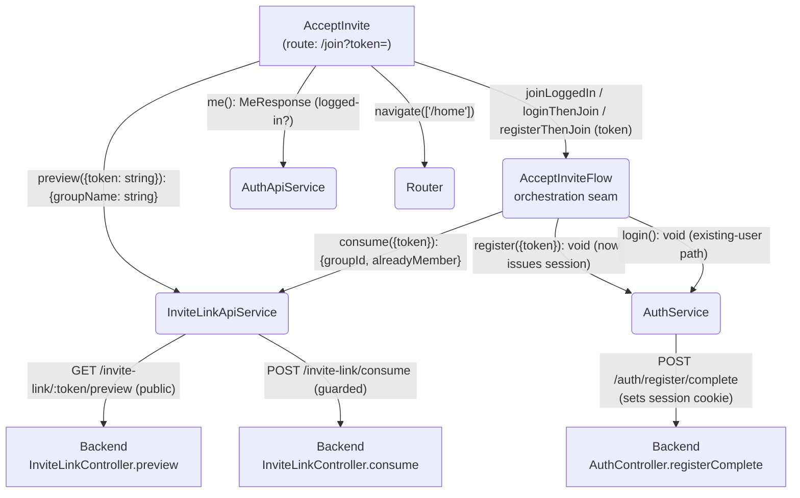
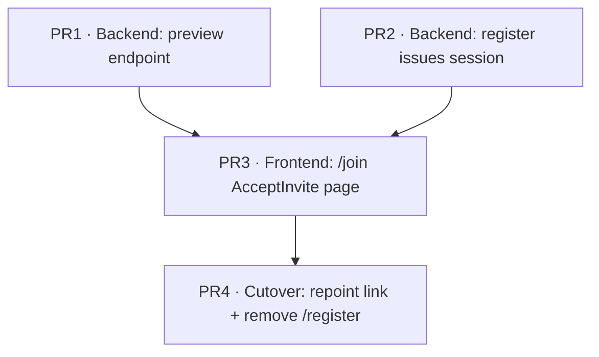

# Goals

A single, seamless landing page for an invite token (`/join?token=<token>`) that works
identically whether the recipient is brand-new, an existing-but-logged-out user, or an
already-logged-in user. This is the screen the invite link points to, replacing today's
bare `/register?token=` link.

- Show **truthful group context**: the recipient sees the name of the group they're being
  invited to *before* committing, resolved from the token via a new unauthenticated peek
  endpoint.
- **New user** → join with a single passkey ceremony (register), then land directly in the
  group already logged in. Registration is made to **issue a session itself** (backend), so
  there is no `register → login` chain and no second passkey prompt — the old post-register
  redirect to `/login` disappears entirely.
- **Existing user, logged out** → log in with a passkey, then join and land in the group.
- **Existing user, already logged in** → one-tap join, land in the group.
- **Already a member** → recognised and sent straight to the group, no error.
- Surface invalid / expired / consumed tokens clearly instead of failing opaquely.

# Non-Goals

- No change to the passkey register/login ceremonies themselves (reuse `AuthService`).
- No multi-device passkey or account recovery (still v1 non-goals).
- No group detail screen — "land in the group" means navigating to the existing home/group
  destination; building the group page is out of scope.
- No email/username collection on the accept page — registration stays passkey-only with the
  invite token as the sole input.
- No change to invite-link creation/expiry semantics (handled in 004).

# Desired Behavior

## On load (`/join?token=<token>`)

- The page calls the unauthenticated peek endpoint; while it resolves a spinner shows with
  legible copy ("Checking your invite…") — not a bare spinner.
- Peek succeeds → a group-context header shows the group name
  (e.g. "You've been invited to join **Trip to Lisbon**").
- **Link no longer valid** (peek returns not-found / expired / consumed, or the token is
  missing) → a single honest message: "This invite link is no longer valid — it may have
  expired or already been used", always paired with a recovery line ("Ask whoever invited you
  for a fresh link"). For a logged-in visitor, also offer a "Go to your groups" button so they
  aren't stranded. No join actions are shown. The UI deliberately does **not** distinguish the
  three causes — the user's next action is identical in all of them (see Alternatives).
- **Couldn't load** (peek network error / timeout — distinct from an invalid link) → a
  "Couldn't load this invite — retry" state with a retry button. A non-401 failure of the
  parallel `me()` call falls back to the logged-out branch rather than blocking the page.

## Logged-in user

- Sees a single primary button: **"Join {group}"**.
- Tap → consume the invite → brief success state on `/join` ("You're in! — {group}") →
  navigate to `/home`.
- If already a member → navigate straight to `/home`, no error shown.

## Logged-out user

We don't yet know whether they're new or returning, so both paths are offered — with the
**existing-account path made primary and most prominent** to steer returning users away from
accidentally creating a duplicate account:

- **Primary, prominent: "Log in to join {group}"** — passkey login → auto-consume the invite
  → success state → land in the group. The group name is carried into the label (trust matters
  most at the auth decision).
- **Secondary, less prominent: "New here? Join with a passkey"** — passkey registration with
  the token (creates account + membership) → auto-login → land in the group, with no bounce
  through `/login`.

The button labels handle a missing/whitespace group name (fallback "Join this group") and long
names (truncate/wrap) so a 393px-wide canvas never overflows.

## Edge cases during an action

- If login/registration succeeds but the user turns out to already be a member → land in the
  group, no error.
- **Passkey ceremony cancelled** (common on mobile — mis-tap, biometric fail) is treated as a
  *neutral* event, not an error: low-key copy ("Passkey not completed — tap to try again"),
  no red error styling. Returns to the same screen with the group-context header intact.
- **Action failure** (consume / login / registration genuinely errors) → inline error with a
  retry affordance; the group-context header is preserved so the user keeps their bearings.
- **Partial failure** in a multi-step chain (e.g. login succeeds but consume then fails) →
  the user is now logged in; retry resumes from the failed step (consume) rather than
  re-running login.

# Design

## Backend — two changes

### 1. Unauthenticated peek endpoint

A small backend addition so the page can show a truthful group name before the user commits.

- **Contract** (`libs/shared/src/contracts/invite-link.ts`): add a `preview` endpoint,
  `GET /invite-link/:token/preview`, response `{ groupName: string }`, reusing the existing
  `INVITE_NOT_FOUND | INVITE_EXPIRED | INVITE_CONSUMED` error enum.
- **Controller** (`invite-link.controller.ts`): `preview` must be reachable without a session
  while `create`/`consume` stay guarded. **Prefer keeping `@UseGuards(SessionGuard)` at class
  level and marking `preview` with a `@Public()` decorator the guard honors** (fail-secure: a
  newly-added method is guarded by default) over enumerating the guard per-method (fail-open if
  one is forgotten). The existing `invite-link.e2e-spec.ts` already asserts `401 without a
  cookie` for both `create` and `consume` — keep those green as the regression net for this
  refactor.
- **Use-case + domain**: `PreviewInviteLinkUseCase` is **read-only, so no unit-of-work** — it
  injects `INVITE_LINK_REPOSITORY` and `EXPENSE_GROUP_REPOSITORY` directly, following the
  `FindMemberUseCase` convention (the uow is reserved for atomic multi-write operations like
  `consumeInviteLink`, which creates a `Member` *and* burns the link in one transaction). It
  calls a pure `previewInviteLink(deps, { token })` whose validation parallels
  `consumeInviteLink`'s — `findByToken` → `NotFound` if missing, `Expired` if `expiresAt < now`,
  `Consumed` if `singleUse && burnedAt !== null` — then resolves the name via
  `deps.expenseGroups.findById(link.groupId)` and returns `{ groupName }`.
  - **`deps` is a *new* shape `{ inviteLinks, expenseGroups }`** — NOT the same as
    `consumeInviteLink`, whose deps are `{ inviteLinks, members }` (it never touches
    `expenseGroups`). Preview parallels consume's *validation steps*, not its dependencies.
  - **Preview is identity-agnostic** (no `userId`, no membership check), so it is intentionally
    *stricter* than consume for an already-member: `consumeInviteLink` checks membership first
    and early-returns, so a member can consume even an expired/burned link, whereas preview
    will report that link as `Expired`/`Consumed`. Acceptable for a peek — call it out so it
    isn't later read as a bug.

### 2. Registration issues a session

Today `registerComplete` (`auth.controller.ts`) returns `void` and sets no cookie — only
`loginComplete` issues the session. That asymmetry is the sole reason a new user had to log in
after registering. We make `registerComplete` **mint and set the session cookie itself**,
mirroring `loginComplete` (same `SESSION_COOKIE_NAME`, same cookie options). Completing a
passkey registration already proves control of the authenticator, so a follow-up login
assertion is redundant friction.

- `CompleteRegistrationUseCase` mints the session **inside its existing `uow.run`** (it already
  creates user + passkey + consumes the invite atomically), wiring `TOKEN_GENERATOR` and the
  session repo as `CompleteLogin` does, and returns the new token. This keeps "session issued
  ⟺ registration committed" atomic — no half-registered session.
- **Extract a single `setSessionCookie(res, token)` helper** used by *both* `loginComplete` and
  `registerComplete`, so the security-critical flags (`HttpOnly`/`Secure`/`SameSite`/`maxAge`)
  have one source of truth and can't drift between the two session-minting paths. The
  `registerComplete` contract response stays `void` (the cookie is the payload).
- This benefits registration everywhere, not just the invite flow — see Kitchen Sink for the
  global-effect coverage and the `secure`-flag pre-prod note.

## Frontend — the accept page

- **Route**: a new top-level route `path: 'join'` → `AcceptInvite`, with **no guard** (must
  serve both logged-in and logged-out users). `create-group-sheet.ts` is updated to build the
  share URL as `${location.origin}/join?token=${token}` instead of `/register?token=`.
- **Remove the standalone `/register` page**: pre-release, and it is now dead code — invites
  land on `/join`, and a tokenless `/register` only ever rendered "Invalid invite link". We
  delete the `register` route, the `Register` component (`.ts/.html/.css/.spec`), and any
  "register" link on the login page. `AuthService.register(token)` is **kept** — `AcceptInvite`
  reuses it.
- **`AcceptInvite` component**: reads `?token=` from the query. On init it resolves two things
  in parallel — `inviteLinkApi.preview(token)` (group name + link validity) and `authApi.me()`
  (logged-in or not) — then renders one of: loading, invalid/expired, logged-in, logged-out.
- **Service reuse** — no new domain logic; existing services are composed:
  - `InviteLinkApiService` gains `preview(token)` and `consume(token)` (today it only has
    `create`).
  - `AuthService.register(token)` and `AuthService.login()` are reused unchanged.
- **`AcceptInviteFlow` service (orchestration seam)** — the three multi-step chains are
  extracted out of the component into a small injectable service, each exposed as a method
  returning an `Observable`, so their ordering is **unit-testable without the DOM**:
  - `joinLoggedIn(token)`: `consume(token)`.
  - `loginThenJoin(token)`: `login()` → `consume(token)` (order matters).
  - `registerThenJoin(token)`: `register(token)` — and **not** `login()` (registration now
    issues the session itself). One passkey ceremony.
  The component subscribes to these, drives the success/error/cancellation UI state, and
  navigates. The component spec then only verifies wiring + rendered states; the
  order-sensitive logic (`login` before `consume`, `register` without `login`, partial-failure
  retry-from-consume) is pinned by `AcceptInviteFlow` unit tests.

## Diagram

## Implementation Details

- **Token in path**: tokens are URL-safe strings ≤ 64 chars, so `/:token/preview` is safe; no
  encoding needed.
- **Parallel load**: `me()` failing with 401 is the *normal* logged-out signal — catch it into
  the "logged-out" branch; a non-401 `me()` failure also falls back to logged-out rather than
  blocking. Only `preview` failures drive the invalid / couldn't-load states.
- **`alreadyMember`**: every join path treats `alreadyMember: true` as success and still
  navigates to `/home`; no special UI.
- **Missing token**: render the invalid state without calling `preview`.
- **Accessibility (native-first, per "less is better" — verify Spartan defaults, don't pile on
  ARIA)**:
  - Wrap the state-swapping region in a single `aria-live="polite"` container so loading →
    loaded → success transitions are announced; the loading state needs visible/SR text
    ("Checking your invite…") so there's something to announce.
  - Render genuine action errors with `role="alert"` (assertive) so a failed join is announced;
    the neutral cancellation message stays in the polite region.
  - The group-context header is a real `<h1>` (`<h1>You've been invited to join
    <strong>{{ groupName() }}</strong></h1>`) — also the focus target for route-change focus.
  - Set a route page `<title>` ("Join a group") so the loading state isn't title-less.
  - Mark `@ng-icons` glyphs `aria-hidden="true"`; buttons keep visible text labels (no
    icon-only buttons, so no `aria-label` needed). Confirm Spartan primary vs secondary button
    variants differ structurally (fill/border/weight), not by hue alone — verification, not new
    markup.
  - **Route-change focus on `navigate(['/home'])` is an app-wide concern**, not solved in this
    component — tracked as a separate issue (see Kitchen Sink).

# Testing Strategy

Backend coverage is added as e2e specs (testcontainers + supertest), per the existing
convention. Frontend coverage is colocated component specs.

## Backend e2e — `invite-link.e2e-spec.ts` (preview endpoint)

### Returns the group name for a valid token, with no session:

- Arrange: insert a user + group named "Trip to Lisbon" + a non-expired multi-use invite link.
- Act: `GET /invite-link/:token/preview` sending **no** session cookie.
- Assert: 200 with `{ groupName: 'Trip to Lisbon' }`.

### Rejects an unknown token:

- Arrange: no link inserted.
- Act: `GET /invite-link/bogus/preview`.
- Assert: error response carrying `INVITE_NOT_FOUND`.

### Rejects an expired token:

- Arrange: insert a link with `expiresAt` in the past.
- Act: preview it.
- Assert: error response carrying `INVITE_EXPIRED`.

### Rejects a burned single-use token:

- Arrange: insert a `singleUse` link with `burnedAt` set.
- Act: preview it.
- Assert: error response carrying `INVITE_CONSUMED`.

### A used multi-use token still previews:

- Arrange: insert a multi-use link already consumed by one member (not burned).
- Act: preview it.
- Assert: 200 with the group name (multi-use links are not consumed by use).

## Backend e2e — `authentication.e2e-spec.ts` (registration issues a session)

### Completing registration creates a session row and a usable cookie:

- Arrange: a valid invite token; drive register-begin/complete with the fake passkey verifier.
- Act: complete registration; capture the `Set-Cookie`.
- Assert: register-complete sets `session_token`; a `session` row exists for the new user.
- **Update the existing `'registers'` test** to also assert the `Set-Cookie` + session row, so
  the happy path and this global effect are pinned by the same test and can't silently regress.

### A freshly-registered user can call a guarded endpoint immediately:

- Arrange: register a brand-new user (no prior login); capture the cookie.
- Act: with only that cookie, call a **guarded** endpoint (e.g. create an invite link).
- Assert: it succeeds — exercising the cookie end-to-end through `SessionGuard`, which is the
  real "issued a real session" claim (`/auth/me` alone is too weak a probe).

## Frontend — `AcceptInviteFlow` service spec (orchestration, no DOM)

### loginThenJoin runs login before consume:

- Arrange: fake `AuthService.login` + `InviteLinkApiService.consume`, both succeed; record call order.
- Act: subscribe to `loginThenJoin(token)`.
- Assert: `login()` resolves before `consume(token)` is called; emits success.

### registerThenJoin registers and does NOT log in:

- Arrange: fake `register` succeeds; spy `login`.
- Act: subscribe to `registerThenJoin(token)`.
- Assert: `register(token)` called; `login()` **never** called.

### loginThenJoin partial failure surfaces at the consume step:

- Arrange: `login` succeeds, `consume` errors.
- Act: subscribe to `loginThenJoin(token)`.
- Assert: errors after login; the error identifies the failed step as consume (so the
  component can offer retry-from-consume without re-running login).

## Frontend — `AcceptInvite` component spec

### Missing token shows the invalid state:

- Arrange: mount at `/join` with no `token` query param; fake `InviteLinkApiService`.
- Act: detect changes.
- Assert: invalid/expired message shown; `preview` was never called.

### Failed preview shows the invalid state:

- Arrange: fake `preview` returns an error; mount at `/join?token=x`.
- Act: detect changes.
- Assert: invalid/expired message shown; no join actions rendered.

### Logged-in user sees a one-tap join:

- Arrange: fake `me()` resolves (logged in); `preview` returns "Trip to Lisbon".
- Act: detect changes.
- Assert: a single "Join Trip to Lisbon" button is shown.

### Logged-in join consumes and navigates:

- Arrange: as above; fake `consume` returns `{ groupId, alreadyMember: false }`; spy Router.
- Act: click "Join".
- Assert: `consume(token)` called; `router.navigate(['/home'])` called.

### Logged-out user sees login-primary, register-secondary:

- Arrange: fake `me()` rejects (401); `preview` returns a group name.
- Act: detect changes.
- Assert: "Log in to join" is the prominent/primary action; "New here? Join with a passkey"
  is present and secondary.

### Logged-out actions call the right flow method (wiring):

- Arrange: logged-out; fake `AcceptInviteFlow` (ordering itself is covered in the flow spec); spy it.
- Act: click "Log in to join …", then (separately) "New here? Join with a passkey".
- Assert: the primary button invokes `loginThenJoin(token)`; the secondary invokes
  `registerThenJoin(token)`.

### Success shows a brief success state, then navigates:

- Arrange: logged in, group "Trip to Lisbon"; flow succeeds; spy Router.
- Act: click "Join".
- Assert: a "You're in! — Trip to Lisbon" success state renders; then `navigate(['/home'])`.

### Already-a-member is treated as success:

- Arrange: logged in; `consume` returns `{ alreadyMember: true }`; spy Router.
- Act: click "Join".
- Assert: success path → navigates `/home`; no error shown.

### Action failure shows retry and preserves context:

- Arrange: logged in, group "Trip to Lisbon"; flow errors.
- Act: click "Join".
- Assert: an error with `role="alert"` and a retry affordance shows; the "Trip to Lisbon"
  header is still visible.

### Passkey cancellation is neutral, not an error:

- Arrange: logged-out; flow rejects with a cancellation (user aborted the passkey prompt).
- Act: click the action.
- Assert: a neutral "tap to try again" message (no error/`role="alert"` styling); header intact.

### Couldn't-load state on a preview network failure:

- Arrange: `preview` errors with a network/timeout (not an invalid-token error).
- Act: detect changes.
- Assert: the "Couldn't load — retry" state renders (distinct from the invalid-link message).

### Non-401 `me()` falls back to logged-out:

- Arrange: `preview` succeeds; `me()` rejects with a 500.
- Act: detect changes.
- Assert: the logged-out actions render (page is not blocked).

## Frontend — `create-group-sheet.spec.ts` (update)

### Builds the share URL against `/join`:

- Arrange: create succeeds, invite-create returns token `abc`.
- Act: drive through to the invite step.
- Assert: the surfaced URL ends with `/join?token=abc` (not `/register?token=abc`).

# PR Plan

- **PR1 — Backend: unauthenticated preview endpoint.** Add the `preview` contract, the
  `previewInviteLink` domain fn + `PreviewInviteLinkUseCase` (direct repo injection, no uow),
  and the public route via a `@Public()` decorator the `SessionGuard` honors (keep the guard at
  class level — fail-secure). Coverage: the five `invite-link.e2e-spec.ts` preview cases, and
  keep the existing `create`/`consume` "401 without cookie" tests green as the refactor net.
  Purely additive; nothing else depends on it yet.
- **PR2 — Backend: registration issues a session.** `CompleteRegistrationUseCase` mints the
  session inside its existing `uow.run` and returns the token; extract a shared
  `setSessionCookie(res, token)` helper used by both `loginComplete` and `registerComplete`.
  Coverage: the new "session row + usable cookie" and "freshly-registered user hits a guarded
  endpoint" cases, plus updating the existing `'registers'` test to assert the cookie/session
  row. Independent of PR1. Safe for the current frontend (which still redirects to `/login`,
  now simply already carrying a session).
- **PR3 — Frontend: the `/join` accept page.** Add the unguarded `join` route, the
  `AcceptInvite` component, the `AcceptInviteFlow` orchestration service, and the
  `preview`/`consume` methods on `InviteLinkApiService`. Implement the state matrix (loading /
  invalid / couldn't-load / logged-in / logged-out / success / error / cancellation) with the
  `aria-live` region, `<h1>`, and page title. Coverage: the `AcceptInviteFlow` service spec +
  the `AcceptInvite` component spec. The page is reachable but not yet the invite target, so
  existing flows are untouched. Depends on PR1 (preview) and PR2 (new-user path lands without a
  login).
- **PR4 — Cutover.** Repoint `create-group-sheet` share URL to `/join?token=`, and delete the
  now-dead `/register` route + `Register` component (`.ts/.html/.css/.spec`) + any login-page
  register link. **Grep for orphans** (`register?token=`, `Register` imports, the route) so no
  dangling references remain; confirm `AuthService.register` retains coverage via the
  `AcceptInviteFlow`/`AcceptInvite` specs. Note `/join` is intentionally a top-level route
  **outside** the `guestGuard` shell (a logged-in user must reach it). Coverage: update
  `create-group-sheet.spec.ts` for the new URL. Only PR that changes user-facing routing; lands
  once `/join` is proven.

# Alternatives Considered

- **Generic, frontend-only header (no peek endpoint).** Avoids any backend change but the
  invitee can't see *what* they're joining until after committing. Rejected: truthful context
  before the decision is the point of the screen.
- **Reuse / expand the `/register` page** to handle all paths instead of a new `/join` route.
  Rejected: overloads an auth page with invite-acceptance and auth-state branching; a single
  purpose-built landing is clearer, and `/register` is now dead anyway.
- **`/invite/:token` path param** instead of `/join?token=`. Fine, but the query form keeps
  parity with the existing `?token=` convention and the begin/complete code already reads it
  that way. Cosmetic; chose the lower-churn option.
- **Frontend `register → login` chain** (two passkey prompts) instead of having the backend
  issue a session on register. Rejected: a second ceremony is redundant friction once
  registration already proves authenticator control.
- **Defer the logged-out-existing-user path.** Smaller slice, but leaves a real hole (a
  returning user on a new device couldn't join), so the join loop wouldn't actually close.
  Rejected in favour of the full flow.
- **Login as the secondary action.** Rejected: making "Join with a passkey" primary tempts
  returning users into duplicate accounts; login is primary by design.
- **Toast / snackbar for join success.** Rejected for a mobile-first app: toasts auto-dismiss
  before they're read, float over the thumb zone, and are awkward for screen readers. Chose a
  brief on-page success state on `/join` (reusing the `aria-live` region) before navigating.
- **Differentiated invalid-link copy** (expired vs used vs not-found). Rejected: the user's
  next action is identical in all three cases — ask the inviter for a fresh link — so the
  distinction is curiosity, not actionability (Nielsen #9 is satisfied by a clear *recovery*
  path, which we keep). One honest combined message instead. (This also happened to resolve a
  security-vs-UX review conflict; the backend still returns granular codes for `consume`/logs.)
- **Three RxJS chains inline in the component.** Rejected on testability: extracted into
  `AcceptInviteFlow` so the order-sensitive logic is unit-tested without the DOM.

# Kitchen Sink

- **Navigation target.** Every success path lands on `/home` because there is no group detail
  screen yet. When one exists (Phase 2+), deep-link to the specific group via the `groupId`
  that `consume` already returns.
- **Peek endpoint exposure.** `preview` is unauthenticated, so anyone holding a token can read
  the group name. This is acceptable — the token *is* the capability, and the name is exactly
  what an invitee needs. Returning granular `NOT_FOUND/EXPIRED/CONSUMED` codes is *not* a
  meaningful leak with 256-bit unguessable tokens (the existence-oracle threat needs guessable
  ids; only a token holder ever sees `EXPIRED/CONSUMED`), so the contract keeps them; the UI
  collapses them to one message for UX reasons, not security. The real exposure surface is
  token *leakage*: set **`Referrer-Policy: no-referrer`** on the `/join` response so the
  `?token=` isn't forwarded to third parties, and ensure the production reverse proxy doesn't
  log the `:token` path segment / query string. Volume abuse is handled by rate-limiting,
  tracked in **issue #18** — confirm #18's scope explicitly covers the new public `preview`
  route and `registerBegin`, not only the authed endpoints.
- **Cookie `secure` flag (pre-prod, security).** `loginComplete` currently sets
  `secure: false` behind a `//TODO`; the shared `setSessionCookie` helper (PR2) must drive it
  from config (`secure: NODE_ENV === 'production'`) before either session-minting path reaches
  production. Tracked as **issue #20**.
- **Open-redirect (future).** Every success path hard-codes `navigate(['/home'])`, and the
  Phase-2 deep-link uses the server-returned `groupId` — both safe. Any future post-join
  redirect target must be an allow-listed internal route or derived from server data, **never**
  from a `?returnTo=`/`?next=` query param.
- **Route-change focus (app-wide a11y).** Angular's router doesn't move focus on navigation, so
  every `navigate(['/home'])` leaves focus orphaned for keyboard/SR users. This is cross-cutting
  (affects the whole app, not just `/join`) and is tracked as **issue #19** rather than bolted
  into this component.
- **Global effect of the register-session change.** Making `registerComplete` issue a session
  changes registration everywhere, not just the invite flow. The only current caller relying
  on the old "no session, go to `/login`" behavior is the `/register` page, which PR4 removes —
  so there's no lingering inconsistency.
- **Auto-distinguishing new vs returning logged-out users.** We show both actions because the
  client can't tell them apart pre-auth. A future enhancement could infer it (e.g. a
  conditional-UI passkey discovery) and collapse to one button. Not now.
